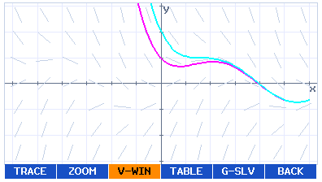

# DIFFEQ for fx-CG50

A native differential-equation grapher add-in for the **CASIO fx-CG50**, inspired
by the DIFF EQ application available on the Algebra FX 2.0.

**Status: Public Beta — v0.9.0-beta.1.** Core functionality has been tested on real
fx-CG50 hardware by the project owner. Additional hardware testing and UI refinement
are ongoing; this is not a claim that every mode and edge case is device-verified.

**Unofficial project. Not affiliated with or endorsed by CASIO.** CASIO and fx-CG50
are trademarks of their respective owner.

[Download DIFFEQ.g3a from Releases](https://github.com/omegalpha210/fx-cg50-diffeq/releases)
· [Report a bug](https://github.com/omegalpha210/fx-cg50-diffeq/issues/new/choose)
· [Detailed controls (Korean)](docs/USER_GUIDE.md)



*Actual application UI rendered by the host test adapter. This is not a calculator
or CPU-emulator screenshot. No manual screenshot is redistributed.*

## Features

- First-order separable, linear, Bernoulli and general equations; linear second-order
  equations; general N-th order equations and systems with 1–9 states.
- Classical fixed-step RK4 integration in both directions from each initial condition.
- Up to 9 independent initial-condition sets; first-order slope fields and field-only mode.
- Configurable V-Window, pan, persistent IN/OUT/AUTO/ORIG zoom, per-curve output and six colors.
- TRACE with retained finite samples, curve selection and exact x queries.
- G-Solve: ROOT, MAX, MIN, Y-ICPT, X-CAL, Y-CAL and two-curve ICPT; sorted multiple results.
- Direct phase portraits for models with at least two states; N-th-to-system conversion.
- Paged numerical Table and STAT-compatible CSV export (up to 998 data rows).
- Explicit SAVE/RCL, two-slot session recovery, per-curve color persistence.

## Calculator compatibility

**Target: CASIO fx-CG50.** Other PRIZM models and calculator emulators are untested;
compatibility is not claimed. This is a native `.g3a` add-in, not a Python program.

## Installation

1. Download **DIFFEQ.g3a** from [Releases](https://github.com/omegalpha210/fx-cg50-diffeq/releases).
   Optional `SHA256SUMS.txt` lets you verify the download.
2. Connect your fx-CG50 to a computer by USB and open the calculator storage drive.
3. Copy `DIFFEQ.g3a` to the **root directory** of that drive.
4. Safely disconnect the calculator using its normal USB disconnect procedure.
5. Launch **DIFF EQ** from the calculator Main Menu.

This follows [CASIO's add-in installation instructions](https://edu.casio.com/content/dam/casio/global/edu-casio-com/download/files/fx-cg50-series/Inst_Users_Guide.pdf).
Only the add-in goes on the calculator; SDKs, source code and development tools are unnecessary.
Keep backups of existing session files when testing beta upgrades.

## Basic workflow

**Equation → Initial Conditions → Solver Parameters → Graph**

Choose a type using Main 1–4 or F1–F4. Enter the equation, use F6 NEXT to set initial
conditions, then F6 NEXT for the solver range and step `h`. F6 GRAPH calculates.
Example: 1st → Others, `y`, initial `x0=0`, `y0=1`; the solution is approximately `exp(x)`.
Use a smaller `h` and compare results when checking numerical accuracy.

## Controls

| Context | Controls |
|---|---|
| Selected field | UP/DOWN selects; LEFT/RIGHT starts editing at the beginning/end |
| Editing | EXE validates and selects the next field; last field commits/stays; EXIT commits/stays |
| Last selected field | EXE performs NEXT/GRAPH/DONE; a second EXE after last-field editing completes |
| Equation | F1 VAR / F2 FUNC replaces the softkey bar; F6 pages; EXIT closes; token keys insert |
| Physical input | ALPHA+ADD = x, ALPHA+SUB = y, NEG = minus; SHIFT+SIN/COS/TAN = inverse trig |
| OUTPUT | F1 G / F2 L; RIGHT or F3 COLOR opens palette; EXE next/last DONE; F4 INIT resets outputs/colors |
| Graph | Arrows pan; F1 TRACE, F2 ZOOM, F3 V-WIN, F4 TABLE, F5 G-SLV |
| TRACE | LEFT/RIGHT moves among retained samples, UP/DOWN changes curve, F1 x=, EXIT returns |
| X-CAL/Y-CAL input | Blank numeric prompt; EXE or F6 RUN validates and runs immediately |
| ZOOM | IN/OUT/AUTO/ORIG retains submenu; EXIT restores Graph controls |
| Session | Main F6 SAVE; F5 RCL chooses RAM recall or saved-session load; MENU returns to the OS |

Multiplication must be explicit (`2*x`, not `2x`). Trigonometric functions use
radians regardless of OS angle settings. `ln` is natural log; `log` is base 10.

## Building from source

The project uses C11, CMake and fxSDK. CMake requires **gint 2.11 or newer**.
The verified development stack is fxSDK/gint 2.11.0, SH GCC 14.1.0, binutils 2.42,
fxlibc 1.5.1 and the pinned OpenLibm SH port. Those exact versions form the tested
baseline, not a promise that every other version works.

With an existing compatible fxSDK toolchain on PATH:

```sh
fxsdk build-cg -j8
python3 tools/verify_g3a.py dist/DIFFEQ.g3a
```

Host regression tests require CMake, a C compiler (the script selects Clang) and Python 3:

```sh
./tools/test.sh
```

UBSan is enabled by default with Clang/GCC. The host adapter runs the real application
sources but does not emulate SuperH, the calculator OS or its drivers.

For the project's existing local SDK alias, use `source tools/env.sh` and
`./tools/build.sh`. See [DEVELOPMENT.md](DEVELOPMENT.md) for the pinned macOS setup,
clean build, optional screenshot generation and toolchain reconstruction. Do not
rerun bootstrap when the SDK already works. Generated binaries are ignored by Git
and distributed as Release assets.

## Known limitations

- Public beta: physical LCD contrast, key/timer timing, MENU reentry, all equation
  combinations and interrupted storage writes still need broader hardware testing.
  See the [42-case retest checklist](docs/HARDWARE_RETEST.md).
- Fixed-step RK4 is not a stiff solver and has no adaptive error estimate. Finite
  output does not guarantee accuracy; singularities or fast oscillations can be missed.
- The `1e100` magnitude guard remains. Graph/TRACE/G-Solve preserve computed valid
  regions, but RK4 does **not** invent a continuation beyond a failed step.
  Each independently anchored IC is a separate curve. [Validity details](docs/NUMERICAL_VALIDITY_AUDIT.md).
- G-Solve searches `Solver X ∩ V-Window X`, regardless of Y clipping. Tangent roots
  without sampled equality/sign changes and features in uncomputed gaps can be missed;
  at most 32 results are retained.
- TRACE retains at most 129 samples per direction; long ranges use a coarser retained
  Step grid. Redraw/Table recomputes values and may be slow for large problems.
- STAT export creates CSV files for manual import into the OS List Editor; it does
  not directly write Main Memory Lists. Session files use the target ABI and are not
  portable from host tests. Save format v4 reads compatible v3 records, but older
  add-in versions may reject newer files.
- Adaptive RK45, nullclines, equilibria, system vector fields and symbolic solving
  are not implemented.

## License and credits

Project-authored code, documentation and original icons are available under the
[MIT License](LICENSE), selected by the project owner. Third-party materials retain
their own terms; see [THIRD_PARTY_NOTICES.md](THIRD_PARTY_NOTICES.md).

Thanks to the fxSDK/gint contributors, fxlibc contributors, OpenLibm contributors
and GNU compiler/toolchain developers. The host test font and key constants are
from the credited gint revision. Original menu icons are generated by this project.
Development used reference calculator manuals, which are **not redistributed**.

## 한국어 안내

fx-CG50용 비공식 DIFFEQ 공개 베타입니다. Releases의 `DIFFEQ.g3a`를 계산기 저장소
최상위에 복사하세요. 식 → 초기조건 → Parameters → Graph 순서이며,
자세한 조작은 [한국어 설명서](docs/USER_GUIDE.md)를 참고하세요. 실제 기기 추가 검증이 진행 중입니다.
