English | [한국어](README_KO.md)

<p align="center">
  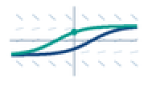
</p>

# DIFFEQ for CASIO fx-CG50

Solve, graph, and explore ordinary differential equations on your calculator.
DIFFEQ is a native **fx-CG50 add-in** with colorful solution curves, slope fields,
TRACE, G-Solve, numerical tables, and phase analysis for two-variable systems.

**Public Beta · v0.12.0-beta.8 · [MIT License](LICENSE)**

**[Download the beta](https://github.com/omegalpha210/fx-cg50-diffeq/releases/tag/v0.12.0-beta.8)**
· [All releases](https://github.com/omegalpha210/fx-cg50-diffeq/releases)
· [Report a bug](https://github.com/omegalpha210/fx-cg50-diffeq/issues/new/choose)

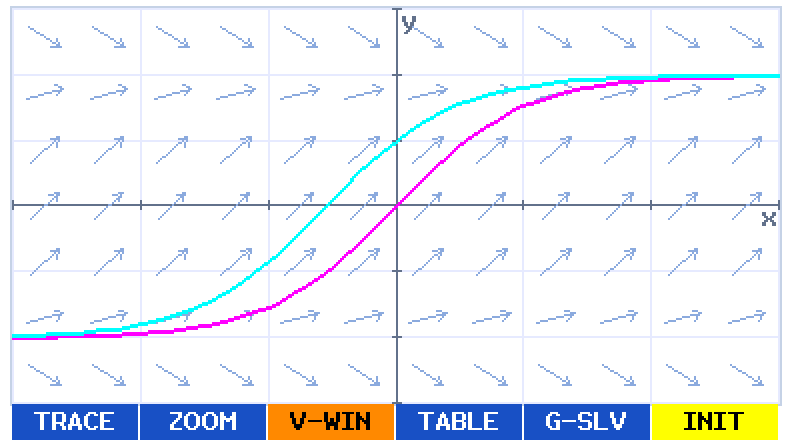

*Screens on this page come from DIFFEQ's actual application renderer running in
the host test harness. They are not hardware photographs or CPU-emulator captures.
Core first/second-order workflows have been tested on an fx-CG50 by the project
owner; this beta's latest UI and device behavior still need hardware retesting.*

Open any image for its full-size view, especially on a phone.

## Choose an equation family

| Main: 2 columns × 3 rows | First-order types: 2 columns × 2 rows |
|---|---|
| 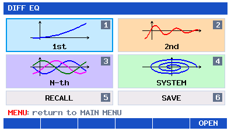 | 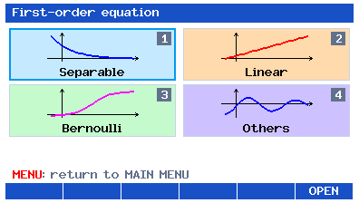 |

Use arrows to select by row/column, digits for shortcuts, and EXE or **F6 OPEN**.
Main's graph tiles and subtype tiles share the same 184×58 geometry; RECALL/SAVE
are shorter text tiles. The eight original graph motifs are drawn from compact
const geometry; [icon files and reproduction](assets/menu/README.md).

## From an equation to a graph

**Equation → Initial Conditions → Solver Parameters → Graph**

| 1. Enter an equation | 2. Set initial conditions |
|---|---|
| 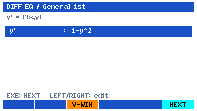 | 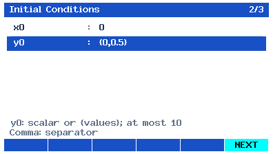 |
| Choose a type, then enter the right-hand side. | A first-order list draws a solution for each initial y value. |

| 3. Choose solver settings | 4. Draw and explore |
|---|---|
| 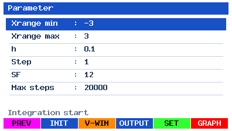 | 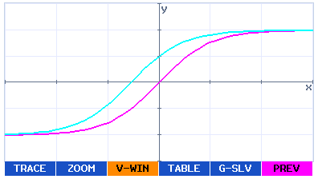 |
| Choose RK4 or RK45, its settings, and optional field density. | Press GRAPH. Pan, zoom, trace, or open a table. |

Headers show **1/3 → 2/3 → 3/3**. Use EXIT to go back from IC or Parameters.
V-WIN is available only from Parameters and Graph.
Use **F6 NEXT** between stages and **F6 GRAPH** to calculate. In a selected,
unedited ordinary field, **EXE** performs the same primary action from any row.

## Take a closer look

| TRACE | G-Solve |
|---|---|
| 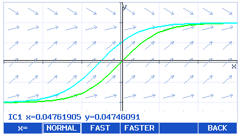 | 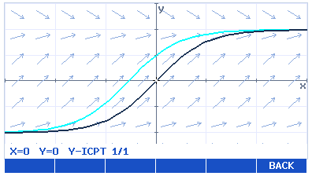 |
| Move along a solution and switch between curves. | Find roots, extrema, intercepts, and intersections. |

| Numerical table | Slope field |
|---|---|
| 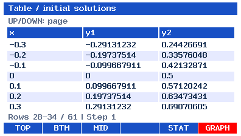 |  |
| Keep x in view while scrolling solutions; export for STAT. | Adjust density in Parameters and style/color in SET. |

## Phase Portraits for 2D Systems

| Enter a two-variable system | Explore its phase trajectory |
|---|---|
| 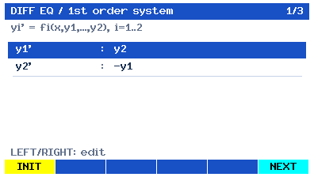 | 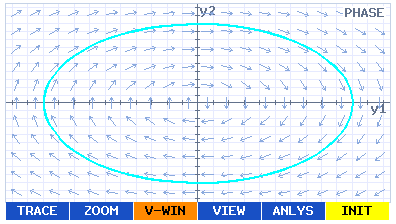 |
| Choose SYS → 2. The pictured oscillator starts at (y1,y2)=(1,0). | After calculating, use F4 VIEW → F2 PHASE. |

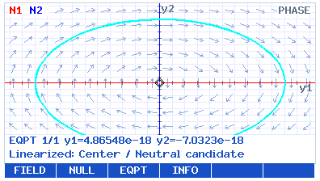

**F5 ANLYS** opens **F1 FIELD**, **F2 NULL**, **F3 EQPT**, and **F4 INFO**.
Toggle arrows/nullclines, search for equilibria, then inspect the numerical Jacobian
and eigenvalues. LEFT/RIGHT cycles found equilibria; EXIT leaves the analysis menu.
N1 (red) is `f1=0`; N2 (blue) is `f2=0`. Use **F4 VIEW → F1 TIME** to return to
the time plot, or **F3 TABLE** within VIEW. Time and Phase keep separate windows.

Equilibria require an autonomous system. Non-autonomous trajectories remain
available; their field/nullclines use the displayed reference **x=x0**.
Stability labels describe the **local linearization**: a Center / Neutral
candidate is not a nonlinear or global stability result. Searches can miss roots;
inconclusive or unavailable classifications are retained honestly.

Both projections reuse a bounded **258-point trajectory cache**. Compatible cached
reprojection and PHASE pan/zoom avoid reintegration; TIME AUTO range changes can
rerun the solver. Closely spaced features can exceed the retained resolution. Phase TRACE uses this cache and stays within its calculated time
range. See [numerical methods and bounds](docs/PHASE_NUMERICS.md).
**HARDWARE TEST REQUIRED:** these new Phase views and interactions are host-tested.

## Solver Methods

| Method | Step control | Use |
|---|---|---|
| **Classical RK4** (default) | Fixed h; Step controls output decimation | Preserve familiar results and compare chosen step sizes |
| **Dormand–Prince RK45** | Adaptive h with embedded local error estimate | Adjust the step automatically as a non-stiff solution changes |

In Parameters, select **Method** and press LEFT/RIGHT. Switching does not start
calculation. RK45 shows **h0**, **RelTol**, **AbsTol**, and **Max steps**;
Step is hidden. Defaults are .1, 1e-6, 1e-9 and 20000 attempts, including rejected
trials. SF remains first-order-only. Both methods share the saved h value;
tolerances and hidden Step persist. INIT retains Method and resets its settings.
v3–v8 sessions load as RK4; v9 retains its saved method. All older formats load Event OFF.

RK45 supports every equation mode, Graph/TRACE/Table/G-Solve and Phase.
Numerical Table/G-Solve queries land at their requested x. TIME and Phase
TRACE movement uses bounded, display-only linear interpolation;
they do not guarantee tolerance accuracy between cached points. RK45 output
uses a TIME Xdot-based grid separately from adaptive internal steps.
**RK45 is an explicit adaptive Runge–Kutta method, not a stiff ODE solver.**
Stiffness or strict tolerances can trigger work limits or Step underflow.
See [coefficients, safeguards, benchmarks and memory](docs/RK45_NUMERICS.md).

## Event Detection and Solver Diagnostics

In Parameters, **F2 ADV → F1 EVENT** defines one `E(x,state)=0` condition.
Choose **ANY / RISING / FALLING** (always relative to increasing x, even backward)
and **MARK / STOP**. MARK continues with up to **32** visible markers while total
hits keep counting. STOP ends each IC/direction at its refined root; Table and
TRACE show **END: Event**, and G-Solve stays within the valid solution.

**ADV → F2 INFO** shows read-only RK4/RK45 status, actual solver work (including
Event refinement), step sizes and Event totals. UP/DOWN scrolls; EXIT returns.
Opening it does not calculate or write files. Parameters **F1 INIT** resets solver settings while retaining Method, Event and V-Window.

| Event Settings | Solver Diagnostics (RK45) |
|---|---|
| 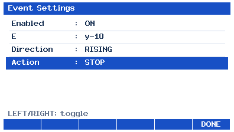 | 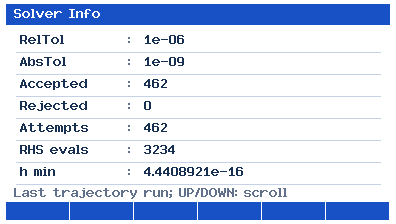 |

Events default OFF. Accepted-step bracketing can miss multiple crossings within
one step; root accuracy remains limited by the numerical solution.
[Event method, benchmarks and limits](docs/EVENTS.md) · [User guide](docs/USER_GUIDE.md)

## Features

- **Seven equation types:** separable, linear, Bernoulli and general first-order;
  linear second-order; general N-th order; systems of ODEs. Orders and systems
  support **1–9 states**, with N-th-to-system conversion and two-state phase portraits.
- **Classical RK4 or adaptive Dormand–Prince RK45**, integrated in both directions from the initial condition.
  First-order `y0` accepts up to **10 values** at a common `x0`; higher-order and
  system input uses one complete initial-state vector.
- **Slope fields** for the four scalar first-order modes: SF density 0–50,
  Segment/Arrow styles and six pale colors. Default: Arrow / Pale Blue.
- **2D SYS Phase:** normalized vector fields, numerical nullclines, up to 16
  equilibrium candidates, and local linear stability with Jacobian/eigenvalue details.
- **V-Window, pan and zoom**, six solution colors and dependent-output ON/OFF.
- **TRACE:** fixed horizontal viewport, Y-only following, NORMAL / FAST / FASTER,
  curve switching, entry-cursor INIT and bounded solver-endpoint jumps.
- **G-Solve:** ROOT, MAX, MIN, Y-ICPT, ICPT, X-CAL and Y-CAL.
- **Table:** ascending x, TOP / BTM / MID, a fixed x column and horizontally
  scrollable solution columns. **STAT-compatible CSV** exports up to 998 data rows.
- **Explicit SAVE / RCL** with recoverable session slots and older-session migration.

TRACE is restricted to the **entry horizontal viewport ∩ the selected curve's
connected valid numerical range**. No TRACE movement extends that range or pans X.
Y follows valid points while retaining the Y span, both scales, Xdot and solver settings.
F1 **INIT** (yellow/black) restores the entry cursor and curve, retaining speed.
F2 **NORMAL** (orange/black), F3 **FAST** (bright green/black), F4 **FASTER** (cyan/black)
move 1×/2×/3× entry Xdot with the existing repeat clock and selected-speed outline.
F5 LEFT/F6 RIGHT target configured solver endpoints and clamp to reachable visible
boundaries. They cannot cross invalid gaps or Event STOP.

Phase fixes the horizontal state bounds (SYS2 y1), follows y2, and traverses the
existing trajectory in integration-time order. It stops before an offscreen retained
point; it never projects a point onto a fake screen edge. A narrow slab containing
no retained state can make TRACE unavailable. **Ordinary Graph/ZOOM/G-Solve-menu pan
and its existing safe expansion remain available after EXIT.**

All numerical/domain warnings now share the plot's top-left anchor, red normal text
and a small opaque white backplate measured to the text. Valid-side TRACE/G-Solve
remain usable; normal Event STOP stays neutral. [Warning and TRACE examples](docs/ui-review/tiles-overview.png).

Graph Settings uses **F1 INIT** to reset Grid, Axis Label and field style/color.
The Style row uses LEFT/RIGHT; F1 INIT is visible and works on every Settings row. F2 stays blank.
First-order lists keep the **191-character** editor limit, with separate count
and length messages. Up to ten solution columns can be explored with x frozen.

## Try the pictured example

Choose **1st → Others** (general first-order) and enter:

```text
y' = 1-y^2
x0 = 0
y0 = {0,0.5}
h = 0.1
```

In Parameters, open **F3 V-WIN** and set Xmin `-3`, Xmax `3`, Xscale `1`, Ymin `-1.5`, Ymax `1.5`,
Yscale `0.5`. Xdot updates automatically. For the original RK4 graph examples, leave Method RK4, Step `1`, SF `12`
and Max steps `20000`. The automatic solver range becomes `-3` to `3`.
The two curves approach y=1 to the right and y=-1 to the left.
Set **SF=0** to reproduce the solution-only view.

Use ALPHA+SUB for `y`, SHIFT+multiply/divide for `{`/`}`, and the physical comma
key between values. Multiplication is explicit (`2*y`); trigonometric functions
always use radians. See the [full controls and examples, in Korean](docs/USER_GUIDE.md).

## Install on your calculator

1. Open the [current beta release](https://github.com/omegalpha210/fx-cg50-diffeq/releases/tag/v0.12.0-beta.8).
2. Download **DIFFEQ.g3a**. `SHA256SUMS.txt` is available to check your download.
3. Connect the fx-CG50 by USB, select USB Flash mode, and open its storage drive.
4. Copy `DIFFEQ.g3a` to the drive's **root directory**, outside `@MainMem`.
5. Safely eject the drive and finish the USB connection.
6. Launch **DIFF EQ** from the calculator's Main Menu.

These steps follow [CASIO's add-in installation guide](https://edu.casio.com/content/dam/casio/global/edu-casio-com/download/files/fx-cg50-series/Inst_Users_Guide.pdf).
You only need the `.g3a` on the calculator. Keep a backup of existing session files
when upgrading: this beta writes format v11 and can read same-device v3–v10 files.
Older add-ins may reject new saves; adaptations are explained in the
[upgrade notes](docs/release/RELEASE_NOTES.md).

## Essential controls

| Context | Keys |
|---|---|
| Main Menu | Digits 1–6 open 1st/2nd/N-th/SYS/RCL/SAVE; arrows select by row/column with wrap, EXE or F6 OPEN opens; F1–F5 blank |
| Selected ordinary field | UP/DOWN selects cyclically; LEFT/RIGHT starts editing; EXE runs NEXT/GRAPH/DONE/OPEN |
| Editing | EXE commits and selects the next field; the last field stays. EXIT commits and stays |
| Equation | F1 INIT; F2 FUNC/F3 VAR only in EDIT (VAR in supported modes). EXIT closes the token bar first |
| OUTPUT | LEFT/RIGHT toggles visibility rows (IC color rows ignore it); F1 INIT, F3 COLOR, F6 DONE. EXE follows the output rows |
| Parameters | F1 INIT; F2 ADV → EVENT/INFO; Method: LEFT/RIGHT toggles RK4/RK45; F3 V-WIN, F4 OUTPUT, F5 SET, F6 GRAPH |
| Graph (except 2D SYS) | Arrows pan; F1 TRACE, F2 ZOOM, F3 V-WIN, F4 TABLE, F5 G-SLV, F6 yellow/black INIT; EXIT returns Parameters |
| 2D SYS Graph | F4 VIEW → F1 TIME / F2 PHASE / F3 TABLE; Phase uses F5 ANLYS; F6 INIT retains selected view |
| Phase analysis | F1 FIELD, F2 NULL, F3 EQPT, F4 INFO; LEFT/RIGHT cycles equilibria, EXIT returns |
| TIME TRACE | LEFT/RIGHT moves, UP/DOWN switches curves; F1 entry-cursor INIT, F2–F4 speed, F5/F6 endpoints clamped to visible valid bounds, EXIT returns |
| Phase TRACE | Shows x, y1 and y2 along the retained trajectory; fixed horizontal state bounds, Y-only follow; no time-range extension |
| Table | UP/DOWN pages, LEFT/RIGHT scrolls columns; TOP/BTM/MID, F5 STAT |
| Session | SAVE confirmation: F5 NO/EXIT cancels, F6 YES/EXE saves once; RCL offers last calculation or saved load; MENU returns to OS |

SF appears only in scalar first-order Parameters. Higher-order/SYS, including
N-th1 and SYS1, hide it and preserve its value, even after Parameters INIT.
First-order INIT resets SF to12. Style and color stay in Graph Settings.

INIT is yellow with black text and resets only its screen's settings. Parameters
retains Method and Event; V-WIN resets window geometry; Graph Settings resets
Grid/Label/field style/color; Output resets dependent outputs/colors. ADV is black
with white text and opens utilities without calculating. SELECT lists wrap at the
ends; editor cursors, Graph/TRACE/Phase and Table navigation retain their behavior.
Main uses pastel tiles, a cyan-blue selection outline and MENU-only help (red MENU). Generic
EXE OPEN/NEXT/GRAPH hints stay hidden; EDIT/palette/BOX/curve confirmation keeps
normal-weight blue EXE. Solver AUTO/MAN and RK45 h0 are unchanged. **TIME/PHASE**
appears only for switchable SYS2 VIEW; enabled **EVT** is independent of equation type.

**Graph F6 INIT** uses the same factory V-Window reset as **V-WIN F1 INIT**, retaining
TIME/PHASE choice and manual solver preferences. Compatible cached samples are
reused; replaced/incomplete cache or Event report uses the existing safe redraw.
**ZOOM F4 ORIG** remains the factory window. **F2 ZOOM → F5 BOX** starts at the
plot center: arrows move 4 pixels, EXE fixes Point1, arrows select Point2, EXE
commits a rectangle at least 6 pixels wide/high. A pale stipple preserves curves;
EXIT cancels either stage without changing the view. TIME/PHASE windows stay separate.

TRACE, G-Solve and BOX share a local 9px black cross with white center; existing 2px
curve blink stays. G-Solve selection uses **UP/DOWN: SELECT GRAPH, EXE: SELECT**
at the graph's top-left, temporarily replacing any warning and restoring it on exit.
EXE alone is blue and normal weight. **One EXIT from selection/results returns to
G-Solve; another fresh EXIT returns Graph.** Held EXIT cannot skip layers. Scratch
query cancellation preserves the original plot and trajectory diagnostics.
Results keep their lower-left panel; a hidden marker causes only the minimum Y
translation, retaining X/scales/Y span and the existing numerical result. A safely
visible marker leaves the view unchanged; result cycling does not rerun G-Solve.

Long **Drawing** keeps the existing Graph visible and temporarily replaces its
bottom six-softkey rectangle with one continuous blue bar: white **Drawing...**
spinner at left, **EXIT cancels** at right, no button separators. About 156 ms
delay, at most 8 Hz; only the bar refreshes. Completion/cancellation restores the
normal controls and preserves accepted results and Last calculation. Initial
Graph entry establishes axes once; cancelling it returns Parameters.
**Table** keeps its dedicated blue preparation header, white EXIT row/body and
hidden softkeys. TRACE/G-Solve retain lower-panel **CALCULATING...** feedback.

**Output: independent ON/OFF and color for every first-order IC.** Select `y`
for one IC or `IC1 y`–`IC10 y` for multiple ICs. LEFT/RIGHT toggles the selected
trajectory; F3 COLOR edits its color. OFF retains the actual color swatch.
Graph/TRACE/G-Solve/Table/CSV/STAT exclude OFF trajectories, while numerical work
and Event hit data remain intact; hidden trajectories' Graph markers are hidden.
All-OFF is safe, with unavailable TRACE/G-Solve and x-only tables/exports.
Output INIT restores all ON/default colors. SAVE v11 retains active/inactive
preferences through count changes; v3–v10 migration initializes all ICs ON and
preserves existing colors. SF stays 0–50, default 12.

**X-CAL/Y-CAL numeric input: EXE confirms; EXIT cancels.** Empty, partial,
valid-uncommitted and error drafts all cancel without validation to the originating
G-Solve page 2. Held EXIT cannot leave a second level; a second fresh EXIT returns
Graph. Only EXE validates/commits this temporary prompt; its F6 is blank/inert.
Other form editors retain their existing controls.

Both former review decisions are closed. **59/59 host/UBSan groups**, strict
28-unit SH build with zero warnings and 13 package checks are repeated on the
exact public source. Numerical algorithms remain unchanged.
[Implementation and validation](docs/VISIBILITY_PROMPT_AUDIT.md) ·
[12 production renderer frames](docs/ui-review/visibility-overview.png).
 Equation/IC F1 INIT resets only its
own inputs. Incomplete drafts remain editable until NEXT validates all fields
and focuses the first error. IC numeric values update only after complete validation;
unfinished IC drafts are runtime-only. Red numerical/domain END remains nonfatal,
with valid-side TRACE/G-Solve available. Output color-line previews persist when OFF.
[Current full audit](docs/FULL_AUDIT.md),
[UI conventions](docs/UI_CONVENTIONS.md), [BOX and updated screens](docs/ui-review/interaction-overview.png).

[Six native and 3× Main/subtype previews; current TRACE and warning screens](docs/ui-review/tiles-overview.png)

## Build from source

With an existing compatible fxSDK/gint installation on PATH:

```sh
fxsdk build-cg -j8
python3 tools/verify_g3a.py dist/DIFFEQ.g3a
./tools/test.sh
```

The build uses C11/CMake and requires gint ≥2.11. Development and release builds
have been tested with fxSDK/gint 2.11.0, SH GCC 14.1.0, binutils 2.42, fxlibc 1.5.1
and the pinned OpenLibm SH port. These are tested versions, not universal minimums.
The host script uses Clang, CMake and Python 3 with UBSan enabled by default.

See [DEVELOPMENT.md](DEVELOPMENT.md) for the existing SDK setup, exact release
checks and image reproduction. Release binaries are built from the public tag;
timestamps mean a later rebuild can have a different file hash.

## Numerical notes and compatibility

**Target: CASIO fx-CG50.** Other calculator models and emulators are untested.

`h` controls the RK4 step. A smaller value can improve accuracy but increases work;
compare results at different h values. Preflight workload checks and Max steps
prevent excessive calculations. RK45 adds estimated local-error control, but
neither method guarantees global accuracy or detects every singularity. The
numerically estimated pole can differ slightly from its mathematical location.
Failed prefixes are not resumed as a new branch.

Nonfinite values and magnitudes above `1e100` are not plotted. Valid computed
prefixes remain usable; the solver does not continue across an unknown gap.
G-Solve can miss unsampled features. TRACE uses a bounded retained/interpolated
sample set; Table may recompute values. CSV requires manual import into STAT and
does not directly write OS lists. See [numerical safety](docs/SOLVER_SAFETY_AUDIT.md)
and [release validation](docs/ACCEPTANCE.md).

**HARDWARE TEST REQUIRED:** new RK45 execution/cancellation and stack high-water, Phase rendering/analysis, the latest LCD layout/colors, held-key and blink timing,
MENU/Fugue reentry, native SAVE/RCL and STAT behavior need device retesting.
The [hardware checklist](docs/HARDWARE_RETEST.md) keeps these separate from host PASS.

## Contribute and report bugs

Please include your calculator/OS version, beta version, equation, initial values,
solver/window settings, exact keys, and expected versus observed behavior.
A DIFFEQ photo or video helps; remove personal details before attaching it.
[Open an issue](https://github.com/omegalpha210/fx-cg50-diffeq/issues/new/choose)
or read [CONTRIBUTING.md](CONTRIBUTING.md).

## License and credits

Project-authored code, documentation and original icons use the [MIT License](LICENSE).
Dependencies retain their own terms in [THIRD_PARTY_NOTICES.md](THIRD_PARTY_NOTICES.md).
Thanks to fxSDK/gint, fxlibc, OpenLibm and the GNU toolchain contributors. The host
font/key data comes from the credited gint revision. Image sources and reproduction
are listed in [docs/images/README.md](docs/images/README.md).

Inspired by the DIFF EQ application on the Algebra FX 2.0. Reference manuals and
manual screenshots are not redistributed. This is an unofficial community project,
not affiliated with or endorsed by CASIO. CASIO and product names are trademarks
of their respective owners.
