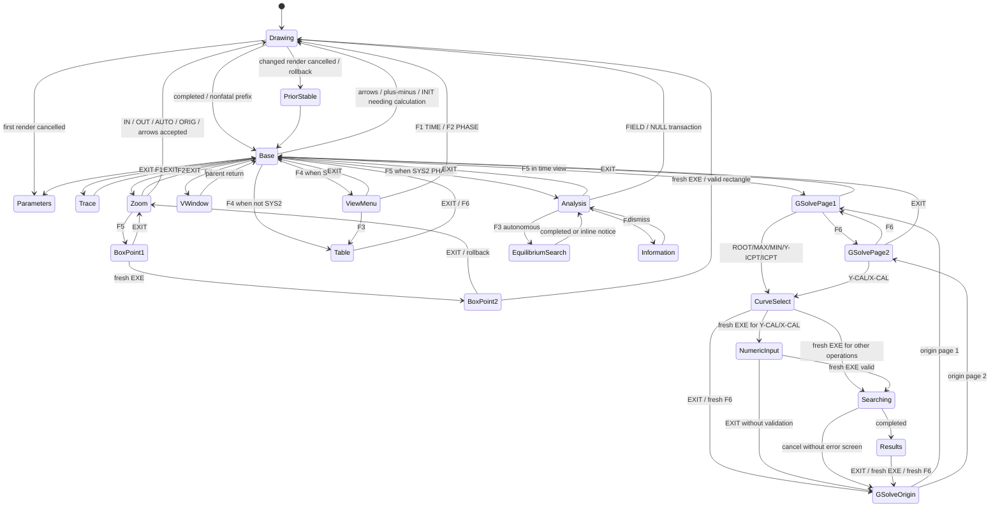

# Code responsibilities, workflows and compatibility

This document maps the implemented native add-in. It describes the existing
product, including its retained compatibility and regression interfaces; it is
not a proposed replacement architecture. Build locations, generators and file
roles are described in [PROJECT_STRUCTURE](../../PROJECT_STRUCTURE.md). User-facing
controls follow [UI_CONVENTIONS](../UI_CONVENTIONS.md), and current verification is
recorded in [CODE_CLEANUP_AUDIT](../audits/CODE_CLEANUP_AUDIT.md).

## Implemented feature inventory

| Feature | Source of behavior | Regression evidence |
|---|---|---|
| Classical RK4 and bidirectional integration | [ode/rk4.c](../../src/ode/rk4.c), [ode/ode.c](../../src/ode/ode.c), model trajectory APIs | [test_core.c](../../tests/test_core.c), [test_model.c](../../tests/test_model.c), [test_full_math.c](../../tests/test_full_math.c) |
| Dormand–Prince RK45, adaptive error/step control, accepted/rejected/RHS work | [ode/rk45.c](../../src/ode/rk45.c), [ode/solver.c](../../src/ode/solver.c) | [test_rk45.c](../../tests/test_rk45.c), [test_rk45_model.c](../../tests/test_rk45_model.c), [test_full_math.c](../../tests/test_full_math.c), RK45 UI |
| Separable/linear/Bernoulli/general 1st order; linear 2nd; higher order 1–9; systems 1–9 | [ode/model.c](../../src/ode/model.c), Equation screen in `app.c` | Model/full-math matrix; workflow and dimension validation |
| Expression parser, function/variable palettes, mode scopes and higher-order conversion | [math/expression.c](../../src/math/expression.c), [ui/editor.c](../../src/ui/editor.c), `model_convert_system` | Expression/model tests, malformed-input stress and conversion canaries |
| Equation/IC drafts, NEXT validation and scoped INIT | `app.c`, [ui/forms.c](../../src/ui/forms.c) | [test_full_workflow_ui.py](../../tests/test_full_workflow_ui.py), workflow-polish/UI controls; allocation failure |
| Parameters, AUTO/MAN solver X range, V-Window/Xdot, Step/SF density 0–50 | [ui/forms.c](../../src/ui/forms.c), [ode/model.c](../../src/ode/model.c), [graph/geometry.c](../../src/graph/geometry.c) | Solver-safety/field/graph-interaction and UI workflows |
| Graph pan/zoom/BOX, factory ORIG/INIT, partial-domain warnings, invalid gaps | [ui/graph_screen.c](../../src/ui/graph_screen.c), [graph/renderer.c](../../src/graph/renderer.c), [graph/trace.c](../../src/graph/trace.c) | Graph-interaction, overlays, busy, stream/valid-region tests |
| TRACE speed/cursor INIT, frozen horizontal viewport and Y-only follow | `ui_trace`, `trace_navigate`, TRACE cache | [test_trace_fixed.c](../../tests/test_trace_fixed.c), [test_trace_cache.c](../../tests/test_trace_cache.c), tiles/TRACE/UI tests |
| G-Solve ROOT/MAX/MIN/Y-ICPT/ICPT/X-CAL/Y-CAL | [ode/gsolve.c](../../src/ode/gsolve.c); Graph operation/menu/result UI | [test_gsolve.c](../../tests/test_gsolve.c), overlay/Event consumer and numeric EXIT UI tests |
| Event E(x,state)=0, ANY/RISING/FALLING, MARK/STOP, bounded markers/report | [ode/events.c](../../src/ode/events.c), [ui/solver.c](../../src/ui/solver.c) | [test_events.c](../../tests/test_events.c), [test_event_consumers.c](../../tests/test_event_consumers.c), Event UI; both methods and directions |
| Generic higher-dimensional phase projection | `graph_more`, shared model/window/render projection | Graph geometry, model and workflow regressions |
| SYS2 TIME/PHASE with independent windows, vector field/nullclines/equilibrium/local stability | [ode/phase.c](../../src/ode/phase.c), [graph/phase.c](../../src/graph/phase.c), VIEW/ANLYS UI | [test_phase.c](../../tests/test_phase.c), phase renderer/cache/UI, full-math matrix |
| Multi-IC ON/OFF and per-IC colors, independent higher/system output visibility | [ode/model.c](../../src/ode/model.c), `ui_output`, graph/table selection | [test_visibility.c](../../tests/test_visibility.c), [test_output_instances.c](../../tests/test_output_instances.c), full persistence and visibility UI |
| Table, CSV and STAT-compatible CSV | [ode/table.c](../../src/ode/table.c), [ui/table_screen.c](../../src/ui/table_screen.c), storage export workers | Unified-table/storage/full-consumer and Table/busy/output tests |
| Explicit SAVE/RCL and RAM Last calculation | `app.c`, `storage.c`, `app_state.c` | Explicit-session policy, full persistence, storage faults and frozen migration fixtures |
| Native MENU/Fugue/SHIFT+AC/ON and SYSTEM power settings | `power.c`, [ui/common.c](../../src/ui/common.c), storage world-switch workers | Native key/power fixtures, I/O faults; physical behavior HARDWARE TEST REQUIRED |
| Semantic F-key colors, delayed Drawing/Table busy, HOLD filtering, wrapping/clamping | [ui/common.c](../../src/ui/common.c), [ui/menu.c](../../src/ui/menu.c), forms/Graph local loops | UI-controls, menu, workflow, visibility and busy pixel/sequence tests |

Private named constants from old sessions are migration input, not a current
constant editor/parser feature. The current parser rejects `A`, `r` and `theta`;
old stored constants are substituted with numeric literals when loading v3–v5.
Graph/Event runtime diagnostics and sample/analysis caches are not saved model
preferences. Physical device validation is never implied by a host pass.

## Parser contract and coverage

The compiler emits bounded stack bytecode; the evaluator is shared by model RHS,
Event and numeric fields. Scope is supplied by the caller. Numeric editor UX must
remain separate: forms retain detailed errors, G-Solve EXIT cancels without
validation, and scalar IC lists preserve their cardinality/magnitude rules.

| Contract | Existing behavior | Tests that pin it |
|---|---|---|
| Numeric tokens | `strtod` numeric literals, decimal/scientific notation, whitespace; constants `pi` and `e` | [test_expression.c](../../tests/test_expression.c), malformed-input stress |
| Binary grammar | `+ -`, `* /`, `^`; explicit `*` required (no implicit multiplication) | `2x` rejected, ordinary arithmetic and exponent tests |
| Precedence/association | Power binds above prefix sign; power right-associates, with unary exponent allowed: `-2^2=-4`, `2^3^2=512`, `2^-3=.125` | Exact expression assertions |
| Unary/parentheses | Prefix `+/-`, parenthesized expression; function calls require parentheses and one argument | Unary/deep/syntax expression tests |
| Functions | `sin cos tan exp ln log sqrt abs asin acos atan sinh cosh tanh asinh acosh atanh`; radians; `log` base 10 | Function value and domain tests |
| Names/case | `x/X`, `y/Y` and `y1..y9`/uppercase variants; function and constant names otherwise case-sensitive | Variable/unsupported-name tests and malformed-input stress |
| State mapping | Ordinary system `y1` is state 0 and `y9` state 8; bare `y` also state 0. Derivative scope maps `y1` to state 1 (`y'`), so at dimension 9 the last valid derivative is `y8` | Expression derivative assertions, model/full-math1–9 matrix |
| Mode scope | Separable f allows x only/g allows y only; linear/Bernoulli/linear 2nd coefficient functions forbid y; general/system allow dimension-bound state; higher-order uses derivative mapping; Event 2nd/higher also uses derivatives | `model_compile`, `model_event_scope`, expression/model/Event matrix |
| Numeric scope | No x/y for scalar numeric expression evaluation; IC list items additionally require finite magnitude≤1e100 | IC/list and UI validation tests |
| Errors | SYNTAX, LIMIT, VARIABLE, DOMAIN, NONFINITE; first compile position retained; failed compile length 0, failed evaluation preserves output | Syntax/domain vectors, field-preserving UI/error tests and corrupted-program stress |
| Limits | Text 191 characters plus NUL; 192 bytecode instructions; 64 literals; 64 stack entries; unary/parser recursion depth 32 | Long/deep input, 40,000 mutated texts, 20,000 corrupt programs, conversion canaries |
| Domain/finite policy | Division by zero, invalid log/sqrt/inverse domains, NaN from power become DOMAIN; infinity/overflow becomes NONFINITE | `1/0`, `sqrt(-1)`, `ln(0)`, negative fractional power, inverse bounds, `exp(10000)` |
| Conversion | `expr_to_system` translates bare y→y1 and derivative y1..y8→y2..y9; functions/numeric scientific tokens are not accidentally renamed; bounded destination | Exact conversion strings and overflow canaries; higher-order/system model tests |

No grammar, token value, bytecode operation, evaluation order or magnitude policy
changed during code cleanup. The additional numerical/UI golden tests compare
production behavior with snapshots recorded before the cleanup; the existing
63 tests remain, with three cleanup contract/tool safety tests added. The old standalone `ui_edit`/`ui_number` were unused
UI wrappers; the actual shared inline editor and parser remain current.

## Responsibility map

| Owner | Current files / important entry points | Boundary / reason to preserve |
|---|---|---|
| Top-level navigation and session drafts | [src/app.c](../../src/app.c): `app_run`, `screen_*`, transitions; [src/app_state.c](../../src/app_state.c): initialization/navigation; [include/app.h](../../include/app.h) | Iterative screen dispatcher, static large App, caller-owned draft state; no recursive screen navigation |
| Parser | [src/math/expression.c](../../src/math/expression.c); [include/expression.h](../../include/expression.h) | Grammar, precedence, unary/power edge cases, bounded bytecode evaluation; protected |
| Model/state layout and mode conversion | [src/ode/model.c](../../src/ode/model.c); [include/model.h](../../include/model.h) | 1st/2nd/Nth up to 9/system up to 9, state labels, projection/output mask and preflight; serialized Document layout protected |
| RK4 | [src/ode/rk4.c](../../src/ode/rk4.c), [src/ode/ode.c](../../src/ode/ode.c); [include/ode.h](../../include/ode.h) | Classical step arithmetic, fixed integration/control, finite/domain/budget guards; protected |
| RK45/controller | [src/ode/rk45.c](../../src/ode/rk45.c), [src/ode/solver.c](../../src/ode/solver.c); [include/rk45.h](../../include/rk45.h) | Dormand–Prince step, estimator, acceptance and adaptive step control; protected |
| Event/report | [src/ode/events.c](../../src/ode/events.c); [include/events.h](../../include/events.h) and model event interfaces | E(x,state), ANY/RISING/FALLING, MARK/STOP, accepted-step crossing/refinement, committed vs staged report; protected |
| Shared path and invalid-region sampling | [src/ode/sampling.c](../../src/ode/sampling.c), [src/ode/validity.c](../../src/ode/validity.c) | Bidirectional integration and restart/gap semantics, callbacks shared across Graph/Table/G-Solve |
| IC list parsing | [src/ode/initial.c](../../src/ode/initial.c); [include/initial.h](../../include/initial.h) | Scalar list cardinality up to 10, numeric bounds, retained color slots |
| Graph geometry / projection | [src/graph/geometry.c](../../src/graph/geometry.c); [include/graph.h](../../include/graph.h) | Clipping, coordinate conversion, slope direction, factory window reset, transactional BOX bounds |
| Raster/render and slope field | [src/graph/renderer.c](../../src/graph/renderer.c): `graph_render`, `graph_auto_window`, warning/event/label APIs | Builds while LCD remains stable; commit/rollback cache/report; full valid-domain segments, slope field and shared point marker |
| Shared sample cache / TRACE mechanics / graph overlays | [src/graph/trace.c](../../src/graph/trace.c); [include/trace.h](../../include/trace.h) | Fixed 258-sample cache and scratch union, connected visible valid samples, frozen horizontal TRACE viewport, Y follow, overlay restore, BOX and busy scratch ownership |
| Graph interaction | [src/ui/graph_screen.c](../../src/ui/graph_screen.c): `ui_graph`, `ui_trace`, `gsolve_menu/run/input`, `zoom_box` | Nested local UI loops; inherited world-switch-safe input and no numerical status invented from UI state |
| G-Solve numeric search | [src/ode/gsolve.c](../../src/ode/gsolve.c); [include/gsolve.h](../../include/gsolve.h) | ROOT/MAX/MIN/Y-ICPT/ICPT/Y-CAL/X-CAL search; protected FP/valid-gap/Event behavior |
| SYS2 analysis numeric | [src/ode/phase.c](../../src/ode/phase.c); [include/phase.h](../../include/phase.h) | Phase vector/nullcline/equilibrium/local linear stability; autonomous eligibility and domain checks; protected |
| SYS2 raster / analysis result ownership | [src/graph/phase.c](../../src/graph/phase.c); [include/phase_graph.h](../../include/phase_graph.h) | Preflight, vector field/nullclines, stored equilibrium results and markers |
| Table/sampled output | [src/ode/table.c](../../src/ode/table.c); [include/table.h](../../include/table.h) | Index/page path, fixed x, up to user-visible outputs, numerical termination retained |
| Table UI/export request | [src/ui/table_screen.c](../../src/ui/table_screen.c): `ui_table` | Independent page/column clamping, delayed preparing screen, STAT export status |
| SAVE/RCL/migrations and CSV | [src/storage.c](../../src/storage.c); [include/storage.h](../../include/storage.h) | Current v11 and v3–v10 read/migrate paths, two-slot preflight/record checks, original legacy files retained, explicit I/O main-thread workers; no namespace/version changes |
| Keyboard/busy/dialog/F-key drawing | [src/ui/common.c](../../src/ui/common.c); [include/ui.h](../../include/ui.h) | Deferred 8-key queue, TRACE cancel priority/repeater, HOLD EXIT boundary, common RTC busy/blink and native bounded uploads, semantic F-key styles |
| Inline editor/tokens | [src/ui/editor.c](../../src/ui/editor.c) | Physical token mapping, selection/commit translation, function/variable palettes and cursor rendering |
| Equation/IC/Parameters/V-WIN/Output forms | Equation in [src/app.c](../../src/app.c); other forms in [src/ui/forms.c](../../src/ui/forms.c) | Deferred draft validation, scoped INIT, numeric editing, multi-IC visibility/color and bounded heap drafts |
| Event/Solver Info forms | [src/ui/solver.c](../../src/ui/solver.c) | Event expression/settings and view of existing committed solver report |
| Tile menu/assets | [src/ui/menu.c](../../src/ui/menu.c), [include/menu.h](../../include/menu.h), generated [src/ui/menu_icons.inc](../../src/ui/menu_icons.inc) | Current 2x3/2x2 wrapping and partial repaint; generated asset is current runtime data, not dead/temp |
| Native lifecycle | [src/main.c](../../src/main.c), [src/power.c](../../src/power.c); [include/power.h](../../include/power.h) | Physical activity ISR observes only; OS calls on main-thread world-switch, safe cancel/rollback before suspend, wake release drain and refresh; HARDWARE TEST REQUIRED |

All 29 native C translation units occur in root CMake. [tests/CMakeLists.txt](../../tests/CMakeLists.txt)
compiles the same numerical/storage source in `core` and actual app/UI sources in
`host_app`; it does not ship the host adapter. Native power/key lifecycle fixtures
compile actual platform/UI source with separate small SDK-interface stubs. Host
reference wrappers used only by tests still belong to current regression coverage.

## Graph interaction responsibilities

`ui_graph` owns the window-change transaction, cached redraw/first-render choice,
rollback, Last calculation commit, submenu dispatch and parent return action.
`render_graph_menu` paints the current semantic F-key strip;
`render_equilibrium_selection` paints markers/labels/EQPT panel from existing
Phase results. `handle_zoom_input` proposes geometry changes and handles the BOX
or AUTO prompt, while `ui_graph` retains preflight and commit/rollback. These
helpers preserve the original drawing/input/FP operation order and allocate no
large state or framebuffer.

`ui_trace` owns the local TRACE loop, blink and saved repeat transform.
`choose_curve`, `gsolve_input`, `gsolve_run`, `show_results` and
`show_gsolve_notice` own their operation layers; the notice renderer needs no App
pointer because it does not mutate session/model state. G-Solve numeric algorithms
remain in [ode/gsolve.c](../../src/ode/gsolve.c).

## Graph state diagram

MENU/OFF are lifecycle interruptions from every input state, not additional app
screens. MENU preserves the current local loop and returns to it after the user
reselects the add-in. During computation MENU/cancel/OFF are observed by the
cancel/deferred queue; power suspension happens after rollback at an idle key wait.
Event display is a layer/termination status on Base/Trace/Results, not a separate
key-handler state. Generic phase projections for non-SYS2 are chosen in OPTN,
remain distinct from SYS2's VIEW/ANLYS and cannot use time G-Solve until phase off.

## Graph key/HOLD table

All rows inherit `ui_getkey`/`ui_blink_key` filtering of held EXIT. Fresh MENU is
handled by the shared power lifecycle and resumes the current screen. SHIFT+AC/ON
requests safe poweroff. “Ignored” below is a literal absence of an action in that
state. Cleanup must not add global F-key/HOLD policy changes.

| State / source anchor | EXE | EXIT | F1–F6 | Arrows / other | HOLD |
|---|---|---|---|---|---|
| Base, `ui_graph` | Ignored | Parameters via `UI_GRAPH_BACK` | TRACE / ZOOM / V-WIN / TABLE or SYS2 VIEW / G-SLV or Phase ANLYS / factory INIT | Arrows pan accepted window 20%; +/− zoom; OPTN graph options | Held EXIT discarded globally; other repeated key behavior currently retained |
| Zoom, `ui_graph` | Ignored | Base | IN / OUT / AUTO / ORIG(factory reset) / BOX / blank | Arrows pan; +/− ignored in Zoom | Same general HOLD behavior; BOX EXE has separate fresh-only guard |
| BOX point 1/2, `zoom_box` | Fresh first sets point1; fresh second commits valid box, too-small remains point2 | Cancel, no geometry commit | All ignored | Arrows move 4 px, clamp 0..383/0..197; invalid-size hint clears after movement | Held EXE ignored; held arrows repeat; held EXIT globally ignored |
| Window preflight error, `accept_window` | Acknowledge | Acknowledge | Ignored | Ignored | ui_getkey EXIT guard only; EXE repeats retain existing behavior |
| AUTO failure / non-SYS2 Phase G-Solve notice, `handle_zoom_input` / `ui_graph` | Acknowledge | Acknowledge | Ignored | Ignored | Same acknowledgement behavior |
| TRACE, `ui_trace` | Ignored | Base; restore overlay/blink/key transforms | INIT cursor + curve only; NORMAL/FAST/FASTER stride 1/2/3; LEFT/RIGHT jumps to solver extents (clamped visible connected valid range) | LEFT/RIGHT navigate frozen entry Xdot; UP/DOWN visible-curve wrap | Repeater 400 ms then 125 ms; EXIT/MENU control priority, stale HOLD dropped when physical key released; held EXIT does not close another screen |
| SYS2 VIEW, `ui_graph` | Ignored | Base | TIME / PHASE / TABLE / blank / blank / blank | Ignored | General held keys retained; no new consent/commit policy introduced |
| SYS2 ANLYS, `ui_graph` | Ignored | Base, redraw cached plot, hide EQPT panel | FIELD toggle / NULL toggle / EQPT / INFO / blank / blank | LEFT/RIGHT wraps roots only when panel shown+nonzero count; UP/DOWN ignored | General held keys retained; FIELD/NULL transactions revert on cancelled render |
| G-Solve page 1, `gsolve_menu` | Ignored | Base | ROOT / MAX / MIN / Y-ICPT / ICPT / page 2 | Arrows pan with preflight/render/rollback; +/− ignored | General HOLD, with operation-specific selection/result guards |
| G-Solve page 2, `gsolve_menu` | Ignored | Base | Y-CAL / X-CAL / blank / blank / blank / page 1 | Same arrows as page 1 | Same |
| Select curve, `choose_curve` | Fresh accepts | Origin G-Solve page | Only F6 CANCEL (fresh); F1–F5 ignored | UP/DOWN wraps visible graph selection; excludes chosen first ICPT curve; LEFT/RIGHT ignored | Held F6/EXE ignored explicitly; EXIT global filter; one curve bypasses picker |
| Numeric X/Y input, `gsolve_input` | Fresh valid commits; invalid keeps draft and inline error | Cancel to origin page 2 without validation/mutation | F1–F5 ignored; F6 blank and ineffective | Digits/dot/neg/+/−/exp/DEL/ACON and LEFT/RIGHT editor only; OPTN ignored | Held EXE ignored; EXIT global filter; generic inline numeric editing otherwise unchanged |
| G-Solve Results, `show_results` | Fresh returns to origin page | Returns to origin page | F6 BACK (fresh); F1–F5 ignored | LEFT/RIGHT result index wrap; Y follow only as needed with X fixed; UP/DOWN ignored | Held EXE/F6 ignored; EXIT global filter |
| G-Solve Notice, `show_gsolve_notice` | Fresh return | Fresh return (global filter too) | F6 BACK fresh | Ignored | Entire break condition requires non-HOLD |
| Drawing/busy, `graph_render`/`ui_busy_cancel` | Deferred input, not confirmation | Cancel first; rollback model window/report/cache/display construction | Deferred 8-key queue; saturation cancels rather than lose input | Deferred | Held EXIT does not cascade after cancel; actual native power/key fixtures preserve cancel priority |
| Event MARK/STOP display | Uses containing state | Uses containing state | Uses containing state | Uses containing state | No extra event-modal keys or invented state |
| Table, `ui_table` | Ignored | Graph | TOP / BTM / MID / blank / STAT / GRAPH | UP/DOWN bounded pages; LEFT/RIGHT bounded columns, no wrap | EXIT guard; ordinary repeated navigation retained |

The `UI_GRAPH_TRACE` action and `APP_SCREEN_TRACE` dispatch remain present although
`ui_graph` currently calls TRACE locally rather than returning that action.
[tests/test_navigation.c](../../tests/test_navigation.c) explicitly exercises the TRACE screen ancestry. This
is a **REVIEW REQUIRED** legacy navigation representation, not safe to remove
because it “looks hard to reach”; this cleanup keeps it.

## SAVE/RCL byte layout and migration

The storage namespace remains `DIFFEQ0.dat` and `DIFFEQ1.dat`. Current SAVE writes
version 11; RCL accepts versions 3–11. Versions 1/2 and newer unknown versions are
not accepted. Every supported version uses integer magic `0x44455131` (`DEQ1` in
the calculator's big-endian bytes). The five 32-bit header fields are magic,
version, size, generation, has_recall. They precede current and recall document
payloads, then a 32-bit FNV-1a checksum over preceding bytes, with ABI tail padding.
The frozen types exist only for versioned streaming offsets; storage never creates
a second whole legacy record on the stack.

The byte counts below were checked with the installed SH compiler's
`-m4-nofpu -mb` ABI from the current type/offset definitions. Native document
prefix 20 B, record alignment 4 B. Host fixtures use their own native ABI and are
semantic compatibility checks, not proof of a portable host/calculator file format.
SAVE is a same-calculator-ABI format; cleanup does not redesign it or bump version.

| Version | SH document / record bytes | Frozen fields/layout difference | Migration to current | Direct frozen fixture coverage |
|---|---:|---|---|---|
|3|2836 /5696|`LegacyDocument` ends before color; private constants[28], 9 IC, per-IC graph/list masks | Substitute stored constants; union allowed graph/list outputs; x always included; default solution colors and Arrow/Pale Blue; adapt multi-vector/shared-x policies with warning; initialize new phase/RK4/Event-OFF/all-IC-ON | [test_field_storage.c](../../tests/test_field_storage.c) independently authors v3 layout and checksum; current+recall/no recall, masks/constants/unsupported expansion/IC adaptation |
|4|2920 /5864|v3 plus 9x9 color matrix; tail padding present, no field appearance | Preserve colors, default Arrow/Pale Blue; other legacy conversion as v3 | Same independent v4 generator, color and default-field assertions |
|5|2920 /5864|Adds explicit field_style/field_color within existing ABI tail bytes | Preserve explicit field appearance/colors; other legacy conversion as v3 | Same independent v5 generator, Segment/color retained; equal v4/v5 size is intentional, version selects fields |
|6|2664 /5352|Constants and old graph/list masks removed; unified output; still 9 IC/color slots | Stream into 10-slot current shape, default new slot colors; independent phase defaults/migrate active SYS2 window; RK4/Event-OFF/all-IC-ON | Frozen V6Document/Record current+recall, 9 slots, inactive 10th defaults, custom solver and no-recall cases |
|7|2752 /5528|10 IC/color slots; original shared TIME/PHASE window | Preserve existing 10 slots; for active SYS2 preserve old view as phase geometry and install TIME defaults without changing stored solver; defaults for new analysis preferences; RK4/Event-OFF/all-IC-ON | Frozen V7 layout, poisoned padding, independent phase migration, solver byte invariants/no-recall |
|8|2824 /5672|Appends phase_view, FIELD/NULL and phase-ready prefs | Preserve independent windows/preferences; default RK4 tolerances, Event OFF, all IC ON | Frozen V8 prefix statically asserted against current adaptive offset, custom current+recall windows/preferences |
|9|2844 /5712|Appends OdeAdaptive method/RelTol/AbsTol | Preserve RK45/RK4 preferences; Event OFF, all IC ON | Frozen V9 prefix statically asserted against Event offset; both docs' method/tolerances retained |
|10|3040 /6104|Appends EventConfig | Preserve Event and adaptive prefs; initialize per-IC mask all ON even when old shared visibility is OFF; padding must not become mask | Frozen V10 prefix statically asserted against ic_enabled offset; poisoned padding, old OFF flag and colors |
|11|3044 /6112|Appends aligned uint16 per-IC visibility mask to frozen v10 prefix | Preserve current/recall mask and inactive color slots; sanitize colors/field density; validate current model before accepting | [test_full_persistence.c](../../tests/test_full_persistence.c), [test_visibility.c](../../tests/test_visibility.c), current record and mask fixtures, current corrupt/unknown version fallback |

For v3–v5 conversion, higher-order/system multi-IC sessions keep one complete
vector and report adaptation; scalar families retain only shared-x entries rather
than silently moving their x. Long/undefined retired-constant substitution keeps
original text and flags expression review. v3–v10 initialize the new IC visibility
mask to all ON. v3–v8 initialize RK4/default tolerance; v3–v9 initialize Event OFF.
The original legacy slot bytes are not rewritten merely by loading.

`newest_valid_slot` probes/checks both generations, then validates the selected
model in App's compiled/load union scratch. A corrupt newest slot can fall back
to the other valid slot; a failed load cannot replace live current/recall. SAVE
validates models, refuses preflight I/O errors or generation overflow, writes the
other slot and rereads/verifies it. File open/read/write/seek/close workers run
within `gint_world_switch` on target. Short reads/writes loop; incomplete files
are removed only after close succeeds, protecting native locked handles.

Compatibility coverage is kept in source fixtures, not loose old binary files:

- [test_field_storage.c](../../tests/test_field_storage.c): independent frozen v3–v10 layouts, all migration policies,
  original-file preservation, invalid current/phase data, truncation and unknown v12.
- [test_full_persistence.c](../../tests/test_full_persistence.c): mode/dimension/method preference matrix, inactive
  fields/colors/current+recall byte preservation and failed-load live-state safety.
- [test_table_storage.c](../../tests/test_table_storage.c), [test_colors.c](../../tests/test_colors.c), [test_list.c](../../tests/test_list.c), [test_visibility.c](../../tests/test_visibility.c):
  current save roundtrip and output/IC preference behavior.
- [test_storage_faults.c](../../tests/test_storage_faults.c): partial/failed writes, short I/O, open/read/seek/close
  injection, beta.9 preflight-error abort, prior-slot and live-document retention,
  failed CSV cleanup.
- [test_autosave.py](../../tests/test_autosave.py): explicit session policy; application startup uses defaults
  and does not silently RCL or SAVE.

## Headers and mutable-state ownership

No hand-written project include cycle exists. `model.h` owns the persisted named
Document and compiled-model state; `app.h` extends it for session/recall; `graph.h`
currently imports `app.h` because its interaction APIs accept App. `ui.h` is a
broader model/forms/render/input API, butits current size alone is not justification for
new umbrella/forward-declaration files. Anonymous typedef structs make an App or
Document forward declaration a change to their source-level type shape. Keep
these definitions and the save ABI stable when changing includes. `menu_icons.inc` is clearly generated
runtime data and remains separate from authored API headers.

| Mutable static owner | Lifetime / init-reset / relation | Native symbol size when available |
|---|---|---:|
| `app.c`: app | Add-in session, app_initialize; current+recall and compiled/load union; serialized current+recall, never move onto stack |15168B|
| `app.c`: pristine fingerprint, compile error index/position | Session defaults/recall/compile; not serialized; controls changed-input confirmation and field selection |12B total, index initialized data |
| `common.c`: pending[8]+count, trace_pending, trace_transform | Key queue across cancel/busy, cleared at TRACE transitions/OFF; native transform saved/restored; not serialized |32+4+4+8B|
| `power.c`: policy/activity/prior_filter | init once, refresh MENU/resume, shutdown restores filter/light; physical-key observer ISR only; not serialized |24+4+4B|
| `events.c`: report/staged_markers | Current numerical report; reset on new/recall, staged transactional capture; Last calculation relation; not direct save payload |2928+2820B|
| [graph/phase.c](../../src/graph/phase.c): results | Phase equilibrium search/reset result; renders markers/info; not serialized |1484B|
| [graph/trace.c](../../src/graph/trace.c): samples | Committed sample cache until invalidate/replaced transaction; not serialized |21244B|
| [graph/trace.c](../../src/graph/trace.c): scratch union | Exclusive overlay/staging/BOX/busy owner; restored before reuse; no extra framebuffer |24096B|
| [graph/trace.c](../../src/graph/trace.c): capture, viewport | Active capture and frozen TRACE entry bounds; begin/end clear state; no save relation |144+36B|
| [graph/trace.c](../../src/graph/trace.c): overlay flags/point patch/cache keys/BOX rect | Graph presentation/cache identity; managed begin/restore/capture; no save relation |Small globals; marker patch intentionally shared |
| `storage.c`: csv_page/csv_buffer, native_read_error | Export worker scratch/preflight I/O flag; operation lifetime, bounded static buffers avoids stack spike; not session SAVE data |816+2048B plus bool|

Moving these large buffers into local structs/stack would worsen device stack
risk. Large buffers must remain off the stack. The beta.9 native
application-frame baseline is app_run 2664 B; current measurements are recorded in
[the cleanup audit](../audits/CODE_CLEANUP_AUDIT.md). Physical stack/heap margin,
LCD DMA, MENU and real sleep/resume remain HARDWARE TEST REQUIRED.

## Kept regression interfaces and dead-code boundary

`ode_integrate` and `ode_rk45_integrate` wrappers remain current numerical test and
benchmark interfaces even when the product uses control variants. The tested
`trace_step`, `trace_follow`, `graph_highlight_curve` and `graph_follow_window`
remain current reference/regression helpers. Tiny return-true callbacks such as
Event `probe_sample` and Phase `discard_segment` are registered paths, not dead
functions. The graph cache hashes, storage checksum and input fingerprints have
different widths/layout/field identities and remain separate.

Cleanup removed only `ui_row`, standalone `ui_edit`, standalone `ui_number`, and
`trace_direction_invalid`: full source/test/tool/generated/callback searches,
native object undefined-symbol checks, ELF/map and relocation checks established
no current caller (except the unused ui_number→ui_edit pair). Their historical
screen/memory evidence remains labelled as history. Parser, numerical algorithms,
SAVE v3–v11, source assets, generated runtime icons, and reference manuals are kept.

For actual validation results and before/after function/byte metrics, use
[CODE_CLEANUP_AUDIT](../audits/CODE_CLEANUP_AUDIT.md). Host drawing/key adapters are
not hardware emulators. MENU/Fugue/OFF/resume, real SYSTEM dim brightness and
physical stack/heap margins remain **HARDWARE TEST REQUIRED**.
