# DIFF EQ UI/UX 리프레시 제안서

> 대상 버전: `0.12.0-beta.10` · 작성일: 2026-10-09 · 상태: **구현 완료 (v0.12.0-beta.11)** — 결과는 [§10](#10-구현-결과)

## 0. 요약

지금 UI는 기능적으로는 완성도가 높습니다. 하지만 시각적으로는 **원색 블록이 너무 많고 화면이 평면적이어서** 투박해 보입니다.
이 제안은 **수치 엔진·입력 흐름·키 동작은 하나도 바꾸지 않고**, 그리는 방식만 손보는 것이 목표입니다.

핵심 변경 5가지:

1. **F키 바**: 원색 블록 6개 → 네이티브 OS 느낌의 짙은 탭. 의미 색(INIT=노랑 등)은 탭 위 3px 띠로 유지합니다.
2. **선택/편집 상태 구분**: 지금은 둘 다 "파란 바"입니다. 선택은 연한 하이라이트, 편집은 테두리 입력 상자로 나눕니다.
3. **도움말 줄**: `LEFT/RIGHT: edit` 같은 텍스트 대신 **키캡 칩**(`[◂▸] edit`, `[EXE] next`)을 씁니다.
4. **오류 표시**: 빨간 글자 한 줄 대신 **오류 배너**와 해당 필드의 빨간 테두리, 오류 위치 마커를 씁니다.
5. **그래프·표 판독성**: TRACE/G-Solve 값 패널을 정리하고, 표 숫자를 오른쪽 정렬하며, 열 색상을 그래프 곡선 색과 맞추고, 스크롤바를 추가합니다.

---

## 1. 이미지에 대하여

| 구분 | 출처 | 의미 |
|---|---|---|
| **현재** | `docs/captures/*.png`, `build/captures/**` | 실제 C UI 코드를 호스트 하네스(`tests/host/gint_host.c`)로 실행해 프레임버퍼를 그대로 저장한 이미지 |
| **제안** | `docs/proposals/ui-refresh/render_mockups.py` | **목업**. 펌웨어와 같은 gint 8×9 폰트 아틀라스, 396×224 해상도, RGB565 양자화 색으로 Python에서 그린 이미지 |

- 제안 이미지는 C 코드로 만든 것이 아닙니다. 다만 **같은 폰트·같은 픽셀 격자·같은 색 깊이**로 그렸기 때문에 실기에서도 거의 같은 모습이 나와야 합니다.
- 목업에 쓴 좌표 규약은 `include/ui.h`와 같습니다: 논리 384×216, 오프셋 (6,4), F키 바 y=198, 도움말 y=184, 필드 피치 22px.
- 그래프 화면 목업은 **실제 캡처 위에 하단 패널만 덧그린** 것입니다. 곡선과 슬로프필드는 엔진이 실제로 출력한 그대로입니다.

---

## 2. 범위: 건드리는 것 / 건드리지 않는 것

### 건드리지 않음 (금지)

| 영역 | 파일 |
|---|---|
| ODE 엔진·솔버·이벤트·샘플링 | `src/ode/**` 전체 |
| 수식 파서 | `src/math/expression.c` |
| 좌표 변환·TRACE 탐색 로직·위상 해석 | `src/graph/geometry.c`, `src/graph/trace.c`의 로직부, `src/graph/phase.c`의 해석부 |
| 저장/복원, 전원, USB | `src/storage.c`, `src/power.c`, `usb_*` |
| 키 바인딩, 화면 전이, EXIT/MENU 처리 규칙 | 모든 `ui_getkey()` 이후의 분기 |
| 숫자 문자열 생성(유효숫자, 지수 표기) | 표시 **배치**만 바꾸고 **값 문자열**은 그대로 둠 |

### 수정 대상 (그리기 코드만)

| 파일 | 수정 내용 |
|---|---|
| `include/ui.h` | 색 토큰 추가/교체 (`UI_NAVY`, `UI_ACCENT`, `UI_SEL_BG`, `UI_TAB`, `UI_ERR_BG` …) |
| `src/ui/common.c` | `ui_frame`, `ui_progress`, `ui_softkeys`, `ui_field_at`, `ui_help`, `ui_form_hint`, `ui_form_error`, `ui_confirm`, `ui_message`, busy 그리기 |
| `src/ui/menu.c` | `ui_menu_draw_tile` (모서리, 배지, 포커스 링, RECALL/SAVE 아이콘) |
| `src/ui/editor.c` | `ui_inline_draw*` (편집 상자 테두리, 오류 위치 마커) |
| `src/ui/forms.c`, `src/ui/solver.c` | 필드 배치, AUTO 칩, Method 세그먼트, Solver Info 섹션화 |
| `src/ui/table_screen.c` | 열 헤더, 정렬, 스크롤바 |
| `src/ui/graph_screen.c`, `src/graph/renderer.c` | **오버레이·하단 패널 텍스트 그리기 함수만** (`axes()`의 색, 상태/값 패널) |

---

## 3. 현재 UI 진단

캡처 66장(`host-overview.png`)과 단계별 캡처를 모두 검토한 결과입니다.

| # | 문제 | 근거 |
|---|---|---|
| D1 | **원색 과다**: F키에 노랑·검정·주황·파랑·초록·빨강·시안·마젠타 8색이 꽉 찬 블록으로 들어감. 화면 하단이 가장 시끄러운 영역이 됨 | Parameters, TRACE |
| D2 | **빈 F키 슬롯도 파란 블록**으로 그려져 "누를 수 있는 것처럼" 보임 | Equation, IC, Solver Info, G-Solve 결과 |
| D3 | **선택 상태 = 편집 상태**: 둘 다 진한 파란 바. 커서 1px 말고는 차이가 없음 | `consistency-equation-edit` vs `equation-entry` |
| D4 | **헤더·선택 바·F키가 모두 같은 파랑**(`UI_BLUE`)이라 위계가 없음 | 모든 폼 화면 |
| D5 | **도움말 문구가 길고 평문**: `LEFT/RIGHT: ON/OFF toggle, F3: COLOR` 같은 문장이 한 줄을 다 차지함. 키와 설명이 시각적으로 구분되지 않음 | Output, IC |
| D6 | **오류가 도움말 줄의 빨간 글자로만 표시**되어 어느 필드가 문제인지, 몇 번째 글자가 문제인지 연결이 약함 (`Syntax error @5`) | `consistency-input-error` |
| D7 | **화면 상단 절반만 쓰고 나머지는 비어 있음** | Equation, IC, Event |
| D8 | **표 숫자가 왼쪽 정렬**이라 자릿수 비교가 어렵고, 열 이름(y1, y2)과 그래프 곡선 색의 연결이 없음 | Table |
| D9 | **TRACE/G-Solve 값 줄**이 `IC1 x=0.047… y=0.047…` 한 덩어리 문자열이라 어느 곡선인지 색으로 알 수 없음 | TRACE, G-Solve |
| D10 | **확인 창이 전체 화면을 흰색으로 지움**. 맥락(어디서 저장하는지)이 사라짐 | Save session |
| D11 | **진행 표시가 ASCII 스피너** `/ - \ |` | Drawing, Preparing Table |

---

## 4. 디자인 원칙

1. **색은 의미가 있을 때만 쓴다.** 의미 색(INIT 노랑, V-WIN 주황, SET 초록, NEXT 시안, GRAPH 빨강)은 그대로 두되, *면*이 아니라 *띠*로 줄인다. 면 색은 "주 실행(GRAPH)"과 "현재 선택된 속도" 같은 활성 상태에만 쓴다.
2. **상태는 모양으로 구분한다.** 선택 = 연한 배경 + 왼쪽 강조선, 편집 = 흰 상자 + 테두리, 오류 = 빨간 배경 + 빨간 테두리.
3. **키는 키처럼 보이게 한다.** 도움말의 키 이름은 키캡 칩으로 그린다.
4. **네이티브 fx-CG50 OS와 어울리게 한다.** 짙은 F키 탭, 위쪽 모서리만 둥근 처리.
5. **기존 기하 계약을 유지한다.** F키 바 영역 (0,198,384×18), 도움말 y=184, 필드 피치 22px·7행, Graph 경고 위치 (7,4), busy 갱신 사각형. 부분 갱신(partial refresh) 로직을 건드리지 않기 위함이다.

---

## 5. 디자인 토큰

`include/ui.h`에 추가하거나 교체할 색입니다. 모두 `C_RGB(r5,g5,b5)` 기준입니다.

| 토큰 | 현재 | 제안 | 용도 |
|---|---|---|---|
| `UI_NAVY` | (`UI_BLUE` 3,10,24) | `C_RGB(4,8,17)` | 헤더 바. 지금보다 한 단계 깊고 덜 쨍한 남색 |
| `UI_ACCENT` | – | `C_RGB(6,16,31)` | 헤더 밑줄 2px, 선택 강조선, 포커스 링, 편집 테두리 |
| `UI_SEL_BG` | – | `C_RGB(25,28,31)` | 선택 행 배경 (연한 하늘색) |
| `UI_SURF` | – | `C_RGB(29,30,31)` | 카드, 키캡, 표 짝수 행 |
| `UI_TAB` | – | `C_RGB(5,7,11)` | F키 탭 배경 |
| `UI_ERR` / `UI_ERR_BG` | `C_RED` | `C_RGB(26,3,3)` / `C_RGB(31,28,28)` | 오류 텍스트·테두리 / 오류 배경 |
| `UI_INK`, `UI_MUTED`, `UI_LINE` | 유지 | `UI_LINE`만 `C_RGB(26,27,29)`로 살짝 밝게 | 본문, 보조 텍스트, 구분선 |
| 의미 색 (INIT/V-WIN/SET/NEXT/PREV/GRAPH) | 유지 | **값은 그대로**, 쓰는 방식만 변경 | `UI_CONVENTIONS.md`의 semantic color 규칙 보존 |

> **글꼴**: 새 폰트를 추가하지 않습니다. 제목·선택 행·활성 탭은 같은 글리프를 x+1에 한 번 더 찍는 **의사 볼드**로 처리합니다. 비용은 글자당 픽셀 쓰기 2배뿐이고, add-in 크기는 늘지 않습니다.

---

## 6. 화면별 제안

### 6.1 F키 바 (모든 화면 공통) — 우선순위 ★★★

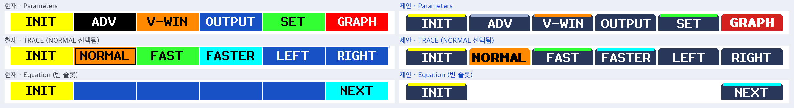

- 탭: `UI_TAB` 짙은 배경, 흰 글자, **위쪽 모서리 1px 라운드**(모서리 픽셀 2개만 배경색으로 덮음).
- 의미 색: 탭 위 **3px 띠**로 표시. INIT·V-WIN·SET·NEXT 같은 의미는 그대로 유지됩니다.
- **주 실행(GRAPH/RUN)만 면 전체를 채웁니다.** 화면마다 "다음에 누를 것"이 하나로 보입니다.
- TRACE 속도: 선택된 속도는 면 전체를 의미 색으로 채우고 검정 볼드 글자를 씁니다 (현재의 외곽선 방식 대체).
- **빈 슬롯은 아무것도 그리지 않습니다** (D2 해결).
- `COLOR` 탭: 무지개 글자 대신 5색 띠 + 흰 글자.
- 구현: `ui_softkeys()` 하나만 고치면 모든 화면에 적용됩니다. 탭 사각형은 기존 `i*64, 198, 63×18` 범위 안에 그립니다.

### 6.2 메인/서브타입 메뉴 — ★★

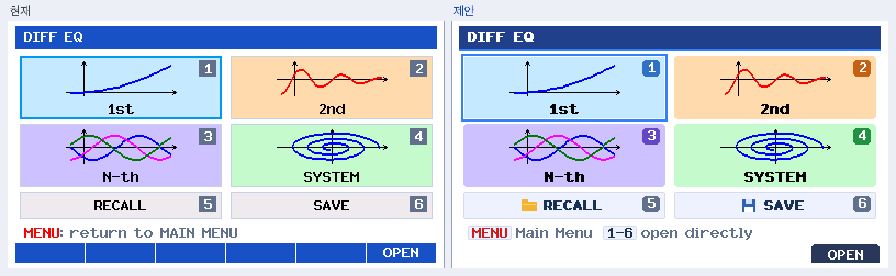

- 타일 배경색과 아이콘은 **그대로** 둡니다 (현재도 충분히 좋음).
- 모서리를 2px 라운드로 하고, 숫자 배지를 회색 대신 **타일 색의 진한 톤**으로 바꿉니다.
- 포커스: 타일 바깥 2px `UI_ACCENT` 링 + 1px 흰 간격. 현재의 안쪽 테두리보다 눈에 잘 띕니다.
- RECALL/SAVE: 폴더·디스크 **선 아이콘**을 추가합니다 (12×12, `ui_line`/`ui_rect`만 사용).
- 도움말: `[MENU] Main Menu   [1-6] open directly`. 숫자키로 바로 열 수 있다는 사실은 이미 구현되어 있지만(`ui_digit`) 지금은 화면에 안내가 없습니다.
- 부분 갱신: 포커스 링이 타일 바깥 2px까지 나가므로, `ui_menu_draw_tile(previous,false)`가 **바깥 2px까지 지우도록** 사각형을 넓혀야 합니다. 타일 간격이 8px/4px이라 여유가 있습니다.

### 6.3 Equation — 선택 상태 — ★★★

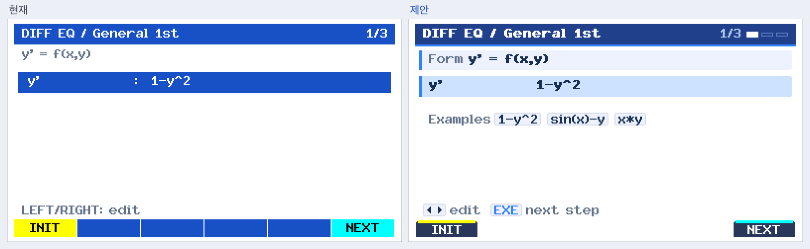

- 헤더: 제목 볼드, 오른쪽 `1/3` 옆에 **3단계 진행 막대**를 둡니다 (완료=회청, 현재=흰색, 남음=외곽선). 단계 라벨 규칙(Equation/IC/Parameters 전용)은 그대로입니다.
- 헤더 아래 2px `UI_ACCENT` 밑줄로 깊이감을 줍니다.
- `y' = f(x,y)` 서식은 **Form 카드**(연한 배경 + 왼쪽 강조선) 안에 넣습니다.
- 필드: 콜론 열을 없애고, 라벨은 `UI_MUTED`, 값은 `UI_INK`로 위계를 줍니다.
- 선택 행: `UI_SEL_BG` + 왼쪽 3px `UI_ACCENT` + 라벨 볼드 (D3·D4 해결).
- 빈 공간에 **입력 예시 칩**(`1-y^2`, `sin(x)-y`, `x*y`)을 둡니다. 표시만 하는 정적 텍스트입니다. *(선택 사항, §8 Q3)*

### 6.4 Equation — 편집 상태 — ★★★

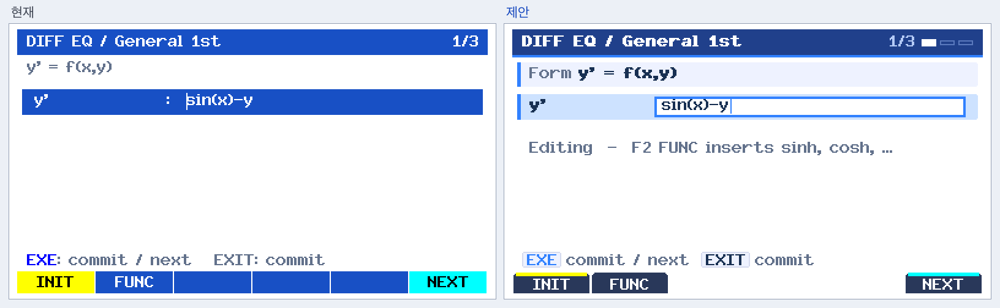

- 편집 중인 값은 **흰 입력 상자 + 2px `UI_ACCENT` 테두리 + 커서**로 그립니다. 선택 상태와 한눈에 구분됩니다.
- 도움말: `[EXE] commit / next   [EXIT] commit`. 문구는 그대로이고 키만 칩으로 바뀝니다.
- 구현: `ui_inline_draw_cursor()`의 배경/전경 인자 처리와 `ui_field_at()`의 행 배경만 바꿉니다. 커서 깜박임(`UiBlink`)과 키 처리는 그대로입니다.

### 6.5 입력 오류 — ★★★

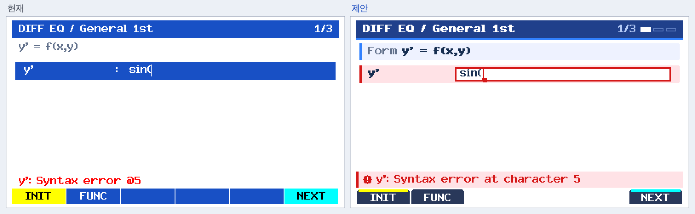

- 오류 필드: 행 배경을 `UI_ERR_BG`로, 왼쪽 강조선과 입력 상자 테두리를 `UI_ERR`로 바꿉니다.
- **오류 위치 마커**: 파서가 이미 돌려주는 위치(`@5`)를 받아 해당 글자 아래에 빨간 밑줄과 ▲를 그립니다. 새로 계산하는 값은 없습니다.
- 도움말 줄 자리(y=178–197)에는 **오류 배너**를 둡니다: 연한 빨강 배경 + 왼쪽 빨간 띠 + `!` 원형 아이콘 + 메시지.
- 메시지 문구 `@5` → `at character 5`는 표시 문자열만 치환합니다. 파서 출력 형식은 그대로입니다.
- `ui_form_error()`, `ui_field_error()` 두 함수에만 적용되므로 IC·Parameters·V-Window·Event 오류에도 자동으로 똑같이 적용됩니다.

### 6.6 Initial Conditions — ★★

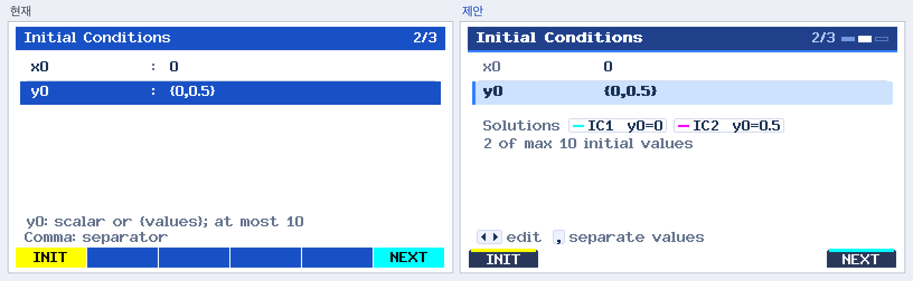

- 리스트 입력 `{0,0.5}`를 **"Solutions" 칩**으로 풀어서 보여줍니다: `[— IC1 y0=0] [— IC2 y0=0.5]`. 각 칩에는 **그래프에서 쓸 곡선 색 견본**이 붙습니다.
- `2 of max 10 initial values` 카운터를 둡니다. 기존 두 줄 도움말(`at most 10`, `Comma: separator`)의 정보를 대신합니다.
- 주의: 칩은 **확정된 값**(이미 저장된 IC)만 읽어 그립니다. 편집 중인 draft는 파싱하지 않습니다 (검증 정책 유지). 색은 Output 설정의 현재 색을 읽기만 합니다.

### 6.7 Parameters — ★★

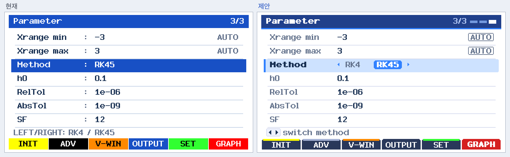

- `AUTO`를 테두리 있는 **상태 칩**으로 바꿔 "값"과 "모드"를 구분합니다.
- Method 선택 행은 **세그먼트 컨트롤** `◂ RK4 [RK45] ▸`로 그립니다. LEFT/RIGHT로 바꾼다는 사실이 화면에 드러나므로 도움말은 `[◂▸] switch method`로 짧아집니다.
- 7행 + 도움말 + F키 배치는 현재와 같습니다.

### 6.8 그래프 TRACE 값 패널 — ★★★

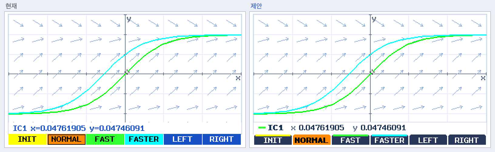

- 하단 패널(y=178–197)을 **불투명 흰색 + 위쪽 1px 구분선**으로 만들어 곡선과 겹치지 않게 합니다.
- 맨 앞에 **곡선 색 견본**(현재 TRACE 대상의 실제 색)을 두고, 그 뒤에 `IC1`(볼드), `x 0.04761905`, `y 0.04746091`을 놓습니다. 라벨은 회색, 값은 진한 색입니다.
- **숫자 문자열은 그대로**이고 `=`만 공백 레이아웃으로 바꿉니다.
- 패널 크기는 현재 busy 패널(`UI_BUSY_TRACE`) 사각형과 같아서 CALCULATING 표시 영역과 충돌하지 않습니다.

### 6.9 G-Solve 결과 — ★★

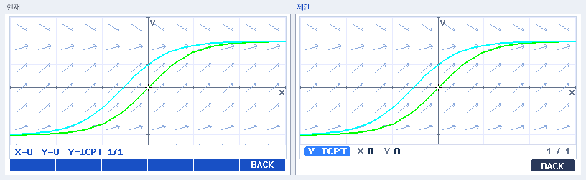

- 결과 종류(`ROOT`, `MAX`, `Y-ICPT` …)를 **강조 칩**으로 맨 앞에 둡니다.
- `X 0  Y 0` 값은 볼드로, `1 / 1` 인덱스는 오른쪽 정렬 회색으로 둡니다.
- 마커 위치 보정(Y 최소 평행이동) 규칙은 패널 높이가 같으므로 그대로 유지됩니다.

### 6.10 Table — ★★★

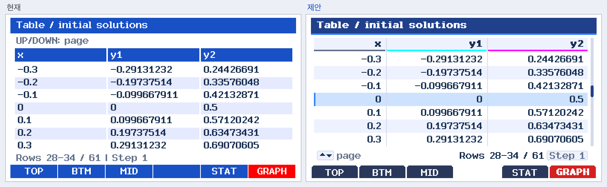

- **모든 숫자를 열 오른쪽 정렬**합니다. 부호와 자릿수가 세로로 맞춰집니다 (D8).
- 열 헤더: 진한 파란 바 대신 연한 배경 + 볼드 이름 + **곡선 색 밑줄 2px**(y1=시안, y2=마젠타). 그래프 색과 표가 바로 연결됩니다.
- 열 사이에 세로 구분선을 둡니다.
- **x = x0 행**(초기 조건 행)에 왼쪽 강조선과 연한 배경을 줍니다. "초기 조건이 어디에 있는지" 기준점을 보여주는 것이고, 행 커서를 새로 만드는 것은 아닙니다.
- 오른쪽 4px **스크롤바**: `Rows 28-34 / 61` 위치를 막대로 보여줍니다.
- 하단: `[▴▾] page` … `Rows 28-34 / 61 [Step 1]`.
- 상단 `UP/DOWN: page` 줄을 하단으로 옮겨 생긴 1행 공간은 헤더 여백으로 씁니다. 표시 행 수는 7행 그대로입니다 (페이지 로직 불변).
- `Left/Right: columns`가 필요한 다열 표에서는 하단 칩에 `[◂▸] columns`를 추가합니다.

### 6.11 Drawing / Preparing 진행 바 — ★

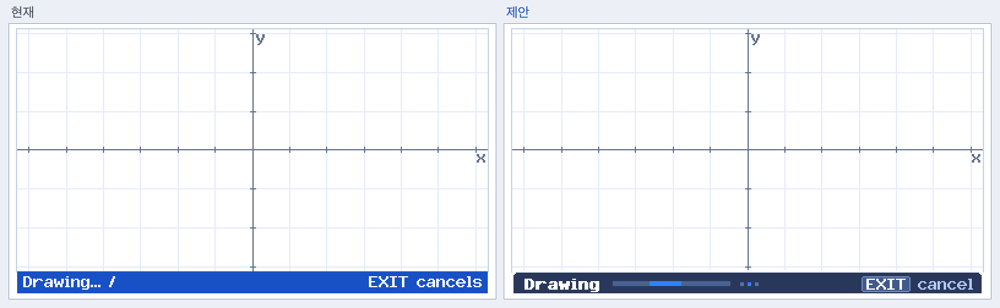

- 같은 사각형 (0,198,384×18) 안에서 `Drawing`(볼드) + **불확정 진행 막대**(블록이 좌우로 이동) + `[EXIT] cancel` 칩을 그립니다.
- 프레임 주기(156.25ms 지연, 최대 8Hz)와 bar-only native refresh 규칙은 그대로 둡니다. ASCII 스피너 프레임 인덱스를 막대 블록 위치로 바꾸기만 합니다.
- 실제 진행률은 엔진에서 받지 않습니다 (불확정 표시). 엔진 수정이 없습니다.

### 6.12 저장 확인 (모달) — ★

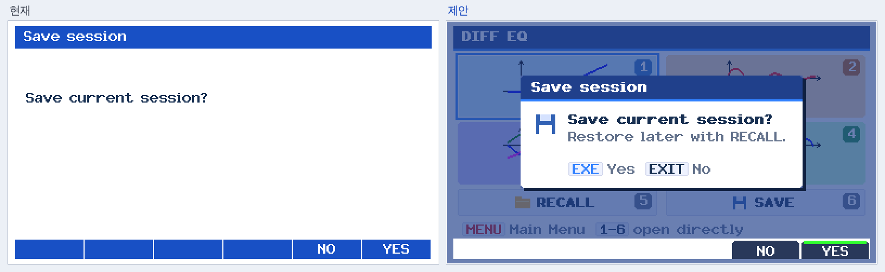

- 전체를 흰색으로 지우는 대신, **직전 화면을 남색으로 어둡게** 덮고 가운데에 카드형 대화상자를 띄웁니다.
- 카드: 남색 제목줄, 디스크 아이콘, 볼드 질문, 보조 설명(`Restore later with RECALL.`), `[EXE] Yes [EXIT] No`.
- F5 NO / F6 YES, 길게 누른 키 무시 등 **동의 규칙은 그대로**입니다.
- 구현 주의: gint 이중 버퍼에서는 VRAM에 직전 프레임이 남아 있다고 보장할 수 없습니다. 그래서 `ui_confirm()` 호출 측이 배경을 다시 그린 뒤 디밍하는 방식(콜백 또는 `redraw` 인자)을 권장합니다. 디밍은 396×224 픽셀에 대해 1회 (r,g,b)→(r+2·navy)/3 연산이라 비용이 작습니다.

### 6.13 Solver Info — ★

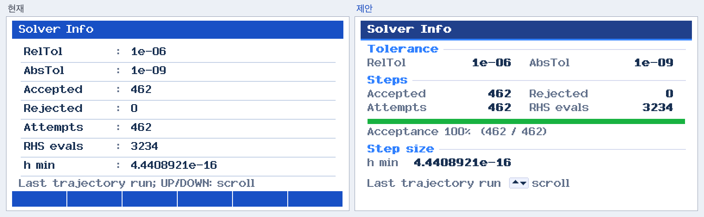

- **Tolerance / Steps / Step size 세 섹션**으로 묶고, 2열 키-값 배치로 스크롤 없이 한 화면에 담습니다.
- `Accepted / Attempts` 비율을 **수용률 막대**로 보여줍니다. 이미 있는 두 정수로 나눗셈만 하는 표시 전용 계산입니다.
- 항목이 더 많은 경우(Event 결과 등)의 기존 스크롤 동작은 유지합니다.

### 6.14 목업은 없지만 같은 규칙을 적용할 화면

| 화면 | 적용 내용 |
|---|---|
| Output selection | 6.3 필드 스타일 + 색 견본 칩 + `[◂▸] ON/OFF  [F3] color` |
| Graph settings / V-Window / Event | 6.3 필드 스타일, 섹션 제목(`Slope Field`)은 6.13 섹션 스타일 |
| 색상 선택 팝업 | 남색 제목줄 카드(6.12와 같은 카드 컴포넌트), 선택 견본 2px `UI_ACCENT` 링 |
| ZOOM / G-Solve 서브메뉴 | 6.1 탭 |
| PHASE 화면 | `PHASE`/`TIME`/`EVT` 표시를 우상단 칩으로, `N1 N2` 범례에 선 견본, EQPT 분석 2줄 패널은 6.8 패널 스타일 |
| Graph 경고/안내 (7,4) | 흰 패딩 박스 → 6.5 배너 축소형 (왼쪽 2px 색띠). 위치와 크기 규칙 유지 |

---

## 7. 구현 계획

### 단계

| 단계 | 내용 | 수정 파일 | 효과 |
|---|---|---|---|
| **P1 공통 컴포넌트** | 토큰, `ui_frame`(밑줄·진행 막대), `ui_softkeys`(탭), `ui_field_at`(선택/편집/오류), `ui_help`(키캡 칩), `ui_form_error`(배너) | `ui.h`, `common.c`, `editor.c` | **전체 화면의 약 70%가 이 단계만으로 바뀜** |
| **P2 화면별** | 메뉴 타일, Parameters 세그먼트/칩, IC 칩, Table, Solver Info | `menu.c`, `forms.c`, `table_screen.c`, `solver.c` | 화면별 완성도 |
| **P3 그래프 오버레이** | TRACE/G-Solve 패널, busy 막대, PHASE 칩, 경고 배너 | `graph_screen.c`, `renderer.c`(오버레이 함수만), `common.c`(busy) | 판독성 |
| **P4 모달** | 확인 창·색상 팝업 카드화 | `common.c`, 호출부의 배경 재그리기 콜백 | 맥락 유지 |

각 단계는 독립된 커밋/PR로 나누어, 문제가 생기면 단계 단위로 되돌릴 수 있게 합니다.

### 성능·메모리

- 새 비트맵, 새 폰트, 힙 할당이 없습니다. 모두 `drect`/`dline`/`dtext` 조합입니다.
- 의사 볼드는 글자당 1회 추가로 그립니다. 라운드 모서리는 모서리당 1–3 픽셀입니다.
- 모달 디밍(1회 약 8.9만 픽셀)이 유일하게 큰 연산이지만, 확인 창을 열 때 한 번만 실행됩니다.
- 부분 갱신 사각형(F키 바, busy 영역, 메뉴 타일)은 크기를 유지합니다. 메뉴 타일만 포커스 링 때문에 2px 넓어집니다.

---

## 8. 검증 계획

| 검증 | 방법 | 기대 결과 |
|---|---|---|
| 수치 불변 | `tests/golden/numerical-beta9.txt` (`test_numerical_golden.py`) | **반드시 그대로 통과**. 하나라도 달라지면 범위를 벗어난 것 |
| 키 동작 불변 | 의미 기반 UI 테스트 (`test_navigation*`, `test_key_lifecycle.c`, `test_interaction_ui.py` 등) | 키 시퀀스와 화면 전이 결과 동일 |
| 픽셀 의존 테스트 | 픽셀·색을 직접 검사하는 테스트 **23개 파일** (`test_tiles_trace_ui.py`, `test_consistency.py`, `test_polish_ui.py`, `test_busy_screen_ui.py` …) | 색/좌표 기대값을 새 토큰으로 **의도적으로 갱신**. 검사 의도(예: "INIT는 노란 의미 색")는 유지 |
| UI 골든 | `tests/golden/ui-beta9.json` (프레임버퍼 해시 18개) | 해시가 바뀌는 것이 정상. README 규칙에 따라 **별도 리뷰를 거친 뒤 재기록**하고, 재기록 커밋에 before/after 캡처를 첨부 |
| 갤러리 | `capture_*.py --update-docs` | `docs/captures` 갱신, 이 문서의 목업과 대조 |
| 실기 | `docs/HARDWARE_RETEST.md` | **LCD 대비 확인 필요**: 연한 `UI_SEL_BG`·`UI_SURF`가 실기 LCD에서 흰색과 충분히 구분되는지. 부족하면 한 단계 진하게 조정 |

---

## 9. 결정이 필요한 사항

| # | 질문 | 제안 기본값 |
|---|---|---|
| Q1 | 현재 `UI_CONVENTIONS.md`는 "Generic EXE OPEN/NEXT/GRAPH help stays hidden"으로 되어 있습니다. 목업은 Equation 선택 상태에 `[EXE] next step`을 보여줍니다. 규칙을 바꿀까요? | 첫 화면(Equation)에만 표시하거나, 기존 규칙대로 숨김 |
| Q2 | 빈 F키 슬롯을 완전히 비울까요, 아주 연한 자리 표시를 둘까요? | 완전히 비움 (네이티브 OS와 같음) |
| Q3 | Equation 화면의 입력 예시 칩은 타입별 정적 문자열이 필요합니다. 넣을까요? | 넣음 (화면 타입당 3개 이하) |
| Q4 | 저장 확인을 모달로 바꿀까요, 현재처럼 전체 화면으로 둘까요? | P4로 미뤄두고 P1–P3 이후 결정 |
| Q5 | `4.86548e-18`처럼 화면 1px보다 훨씬 작은 값을 `≈0`으로 보여줄까요? 표시 전용이지만 "값을 바꿔 보이게 하는" 결정입니다 | **이번 범위에서 제외** (수치 표시 정책은 손대지 않음) |
| Q6 | UI 언어는 영어를 유지할까요? | 유지 (폰트가 ASCII 전용) |

---

## 부록: 목업 재생성

```sh
# 호스트 캡처가 build/captures에 있어야 함 (./tools/test.sh 후 python3 tools/capture_*.py)
python3 docs/proposals/ui-refresh/render_mockups.py "$PWD" docs/proposals/ui-refresh
```

`render_mockups.py`는 `tests/host/font_data.h`의 gint 글리프 테이블을 직접 읽어 그립니다. 펌웨어 소스는 import하거나 수정하지 않습니다.

---

## 10. 구현 결과

§9 답변과 추가 요청을 반영해 구현했습니다. 아래 "구현 결과" 이미지는 목업이 아니라 **실제 C 코드를 호스트 하네스로 실행해 캡처한 화면**입니다.

### 10.1 결정 사항 반영

| 항목 | 반영 내용 |
|---|---|
| 원칙 1: 선명함 | 목업에 있던 **라운드 모서리와 의사 볼드를 모두 제거**했습니다. 의사 볼드는 `m`처럼 획이 촘촘한 글자를 뭉갭니다. 1px 직사각형·선만 쓰고, 새 폰트·비트맵·안티앨리어싱은 없습니다. |
| 해상도 396×224 | **헤더와 F키 탭을 LCD 끝까지 확장**해 테두리가 떠 보이던 문제를 없앴습니다. 단, **그래프 플롯(384×198)은 그대로** 두었습니다. 플롯 픽셀 폭이 Xdot, TRACE 이동 간격, V-Window `dot` 값을 직접 결정하기 때문에 폭을 바꾸면 수치 동작이 달라집니다. |
| Q1 EXE 규칙 | 편집 중 안내를 규칙대로 구분합니다. 마지막 칸이 아니면 `[EXE] commit + next field`, 마지막 칸이면 `[EXE]/[EXIT] commit`. SELECT 상태의 일반 EXE 안내는 기존 규약대로 숨깁니다. "마지막 칸에서 EXE는 commit만 하고, 한 번 더 누르거나 F6을 눌러야 다음 화면" 규칙을 새 테스트로 고정했습니다. |
| Q2 빈 슬롯 | 비웠습니다(픽셀 없음). |
| Q3 예시 칩 | 구현했습니다. 선택한 **칸마다** 그 칸의 수식 범위에서 유효한 예시를 보여줍니다(예: Separable `g(y)` → `y`, `1-y^2`, `y*(1-y)`). 표시 전용이며, 행이 5개 이상이면 숨깁니다. |
| Q4 모달 | 모든 확인창(저장, 크기 변경, 연립 변환, 불러오기)을 어두운 배경 위 카드로 바꿨습니다. 키 동작은 그대로입니다. |
| Q5 ≈0 표시 | 보류했습니다(값 문자열 변경 없음). |
| `:` / `=` | 수학적 값을 정의하는 행(방정식, 초기값, Event `E`)은 `=`, 설정 행은 `:`를 씁니다. |
| RK45 스크롤바 | 목록이 화면보다 길면 오른쪽 3px 스크롤바가 나타납니다(Parameters RK45, IC, Output, 연립 방정식, Table, Solver Info, Recall 목록). |

### 10.2 이전 → 구현 결과

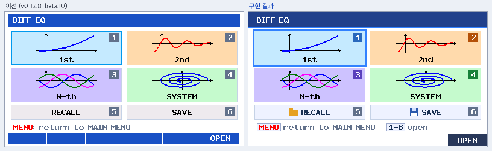
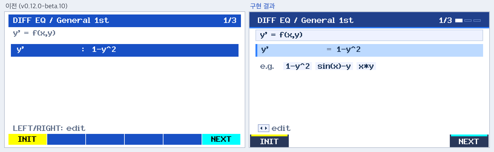
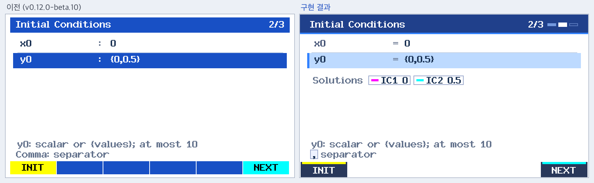
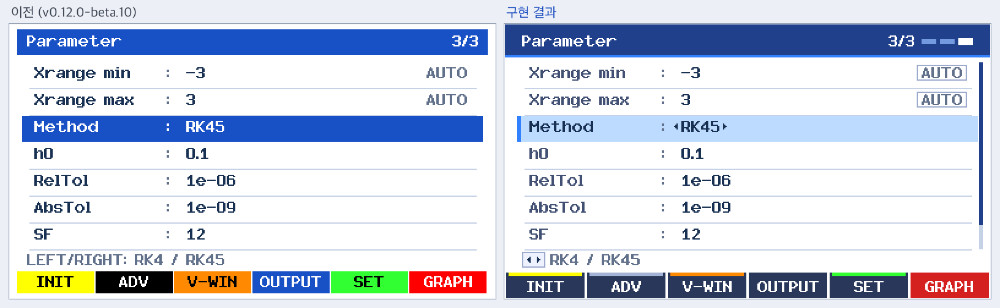
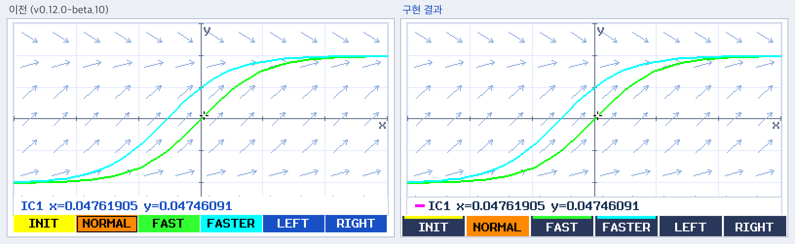
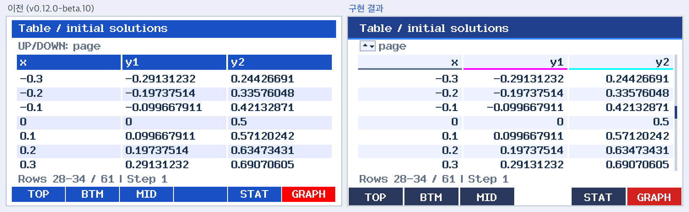

### 10.3 새 상태 화면

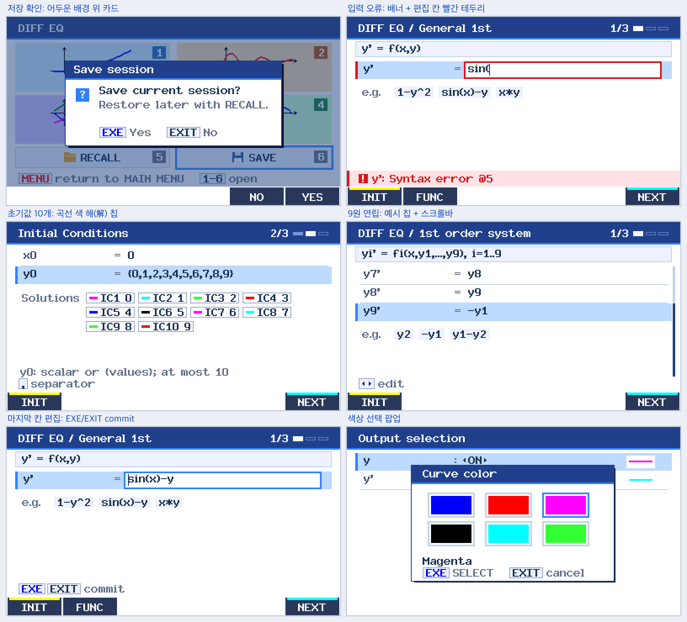

### 10.4 목업과 달라진 점

- Form 카드는 강조선 없는 회색 테두리 카드로 바꿨습니다. 선택 행과 똑같이 보이면 헷갈리기 때문입니다.
- 오류 시 빨간 표시는 **편집 중인 칸**(원인이 확실한 칸)에만 붙습니다. 단순히 선택돼 있던 행은 표시하지 않습니다.
- 오류 문구의 `@5`는 파서 출력 그대로 두었습니다. 대신 컴파일 오류 시에는 기존대로 커서가 오류 위치로 이동합니다.
- Solver Info는 섹션 2열 배치 대신 새 행 스타일과 스크롤바만 적용했습니다. 항목 수가 상황에 따라 7–22개로 바뀌어서 고정 배치가 맞지 않습니다.
- TRACE 견본은 곡선의 고유 색입니다. TRACE 중인 곡선은 기존대로 반전색으로 깜박입니다.

### 10.5 검증

| 항목 | 결과 |
|---|---|
| 엔진 코드 변경 | `src/ode`, `src/math`, `geometry.c`, `trace.c`, `phase.c`, `storage.c`, `power.c`: **0줄** |
| 호스트 테스트 | 68/68 통과(UBSan). 수치 골든 `numerical-beta9.txt`는 **수정 없이** 통과 |
| 엔진 동일성 | 22개 워크플로에서 REPORT·METRICS·화면 수치 판독값이 원본 소스와 **완전히 동일** |
| UI 골든 | 18개 워크플로의 REPORT·FRAME 순서가 원본과 동일함을 확인한 뒤 픽셀 해시만 1회 재기록(`tests/golden/README.md`에 기록) |
| 픽셀 테스트 갱신 | 색·좌표 기대값만 새 디자인으로 바꿨고 검사 의도는 유지했습니다. 도움말 원문 검사는 호스트 전용 `HINT` 로그로 대체했습니다(`#ifndef FXCG50`, 펌웨어에는 없음). |
| 네이티브 빌드 | `dist/DIFFEQ.g3a` 생성, 경고 0, 컨테이너 검사 13/13 통과 |
| 실기 | **HARDWARE TEST REQUIRED**: 연한 선택색(`UI_SELECT`)과 표면색이 실제 LCD에서 흰색과 충분히 구분되는지 확인 필요 |
